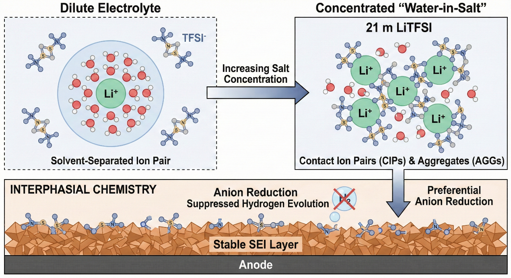

  
  <h1>Happy Figure: AI 科研绘图实战教程（⚠️ Alpha内测版）</h1>
  <h3>🎨 把时间还给逻辑，用 AI 绘就你的科研故事</h3>

  

    
    
    
    
  

---

> [!CAUTION]
> ⚠️ Alpha内测版本警告：此为早期内部构建版本，尚不完整且可能存在错误，欢迎大家提Issue反馈问题或建议。

## 🎯 项目介绍

在论文投稿的“最后一公里”，你是否常为一张结构示意图反复调整？是否在复杂的绘图软件和抽象的配色方案前望而却步？

**Happy Figure** 是我们推出的系统性 **AI 科研绘图实战教程**。我们认为，科研插图不仅是美化，更是科学信息的“视觉化转译”。

本项目旨在教你穿透工具的表象，利用先进的 AI 图像生成模型（如 **Nano-Banana Pro**、**Qwen-image-2.0** 等），通过**结构化提示词（Structured Prompts）**和**工作流精准控制**，将晦涩的论文逻辑转化为符合顶级期刊标准的学术插图。

---

## 🖼️ 效果展示

> [!NOTE]
> **以下插图均由本教程介绍的 AI 工作流生成并经矢量化微调，覆盖计算机、材料、生物等核心领域。**

<table align="center">
  <tr>
    <td align="center" width="50%">
       
      <b>计算机科学：Transformer 架构逻辑图</b>
    </td>
    <td align="center" width="50%">
       
      <b>材料化学：水系电解液微观机制</b>
    </td>
  </tr>
  <tr>
    <td align="center" width="50%">
       
      <b>生物医学：铁死亡信号通路图</b>
    </td>
    <td align="center" width="50%">
       
      <b>成果交付：高精度矢量化重构结果</b>
    </td>
  </tr>
</table>

---

## 👥 项目受众

- 🎓 **硕博研究生**：希望提升论文插图质量，缩短投稿准备周期的科研新手。本项目将显著降低绘图门槛，仅需具备基础科研逻辑。
- 🧑‍🏫 **科研从业者**：追求高效、精准的科研表达，需打造个人/团队学术风格。
- 🎨 **学术设计爱好者**：对 AI 与科研交叉领域感兴趣，探索视觉艺术与科学逻辑的结合。

---

## 📚 快速开始

### 在线阅读
[🌐 点击这里开始在线阅读](https://datawhalechina.github.io/happy-figure/) — 无需下载，随时随地学习。

### ✨ 你将收获什么？
- 📖 **开源免费**：完全免费学习本项目所有内容，与 Datawhale 社区共同成长。
- 🔍 **理解核心原理**：重新审视科研插图的视角，将其视为科学信息的视觉化转译。
- 🏗️ **掌握核心工具**：快速上手 Nano-Banana Pro 等主流 AI 绘图工具。
- 🛠️ **提示词工程实战**：学会将论文逻辑转化为高质量图表的精准描述语言。
- 🚀 **跨学科解决方案**：直接获取材料、生物、CS 等领域的专属出图模版与攻略。
- ⚙️ **高阶控图能力**：掌握复杂长图拆解与 AI 生成图的矢量化重构。
- ⚖️ **守住学术底线**：明确 AI 绘图在学术合规与版权界线上的操作要求。

---

## 💡 如何学习

项目分为三个核心模块，每一阶段都是通往学术绘图自由的坚实阶梯：

- **模块一：认知与工具（入门篇）**：我们将从认知层面打破“绘图=美化”的误区。随后带你快速完成工具接入，建立基础实践能力。
- **模块二：方法与实战（实战篇）**：这是教程的灵魂。你将学习从论文中抽象结构关系，并掌握跨学科（材料、生物、计算机等）的专属出图攻略。
- **模块三：交付与合规（进阶篇）**：进入工程交付阶段。你将学习如何多层控图、如何实现矢量化重构，并深入了解 AI 绘图的学术道德边界。

---

## 📖 目录

| 章节 | 关键内容 | 状态 |
| :--- | :--- | :---: |
| **前言** | [项目的初衷、愿景与核心价值](docs/preface.md) | ✅ |
| **第一部分：认知与工具 (入门篇)** | | |
| [第一章 导论](docs/chapter1/index.md) | AI 时代科研绘图的新范式与本质认知 | ✅ |
| [第二章 工具速查](docs/chapter2/index.md) | Nano-Banana Pro 快速接入与基础操作指南 | ✅ |
| **第二部分：方法与实战 (实战篇)** | | |
| [第三章 提示词工程](docs/chapter3/index.md) | 结构化视觉图式 (Visual Schema) 的构建逻辑 | 🚧 |
| [第四章 场景实战](docs/chapter4/index.md) | 材料、化学、生物、医学等学科专属出图攻略 | 🚧 |
| **第三部分：交付与合规 (进阶篇)** | | |
| [第五章 高阶控图](docs/chapter5/index.md) | 模块化拆解、母图锚定与矢量化重构技术 | 🚧 |
| [第六章 避坑指南](docs/chapter6/index.md) | 学术诚信、版权边界与合规引用范式 | 🚧 |
| [第七章 结语](docs/chapter7/index.md) | 教程总结、致谢与未来展望 | 🚧 |
| **附录** | | |
| [AI 科研绘图实战速查手册](docs/appendix/quick-reference.md) | 核心工具、跨学科提示词模板与学术合规红线速查 | ✅ |

---

## 👥 贡献者名单

| 姓名 | 角色 | 贡献内容 |
| :--- | :--- | :--- |
| [张鼎伦](https://github.com/BAIKEMARK) | 项目负责人，Datawhale成员 | 整体架构设计、核心内容编写 |

---

## 🤝 参与贡献

- 如果你发现了一些问题，可以提 Issue 进行反馈，如果提完没有人回复你可以联系[保姆团队](https://github.com/datawhalechina/DOPMC/blob/main/OP.md)的同学进行反馈跟进~
- 如果你想参与贡献本项目，可以提 Pull Request，如果提完没有人回复你可以联系[保姆团队](https://github.com/datawhalechina/DOPMC/blob/main/OP.md)的同学进行反馈跟进~
- 如果你对 Datawhale 很感兴趣并想要发起一个新的项目，请按照[Datawhale开源项目指南](https://github.com/datawhalechina/DOPMC/blob/main/GUIDE.md)进行操作即可~

---

## 🙏 致谢

感谢 Datawhale 社区及其成员对本项目的支持。技术不仅是效率的提升，更是思考方式的进化。

---

## 📈 Star History

<a href="https://www.star-history.com/?repos=datawhalechina%2Fhappy-figure&type=date&logscale=&legend=top-left">
 <picture>
   <source media="(prefers-color-scheme: dark)" srcset="https://api.star-history.com/image?repos=datawhalechina/happy-figure&type=date&theme=dark&logscale&legend=top-left" />
   <source media="(prefers-color-scheme: light)" srcset="https://api.star-history.com/image?repos=datawhalechina/happy-figure&type=date&logscale&legend=top-left" />
   
 </picture>
</a>

---

## 关注我们

扫描下方二维码关注公众号：**Datawhale**，获取更多优质开源内容。

  

    
  

---

## 📜 开源协议

本作品采用[知识共享署名-非商业性使用-相同方式共享 4.0 国际许可协议](http://creativecommons.org/licenses/by-nc-sa/4.0/)进行许可。

---

  
如果你觉得这个项目对你有帮助，请给我们点个 <b>Star</b> ⭐，这将是对我们最大的鼓励！

