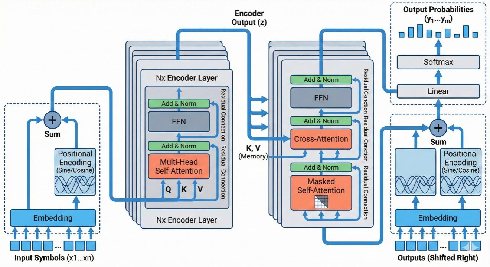
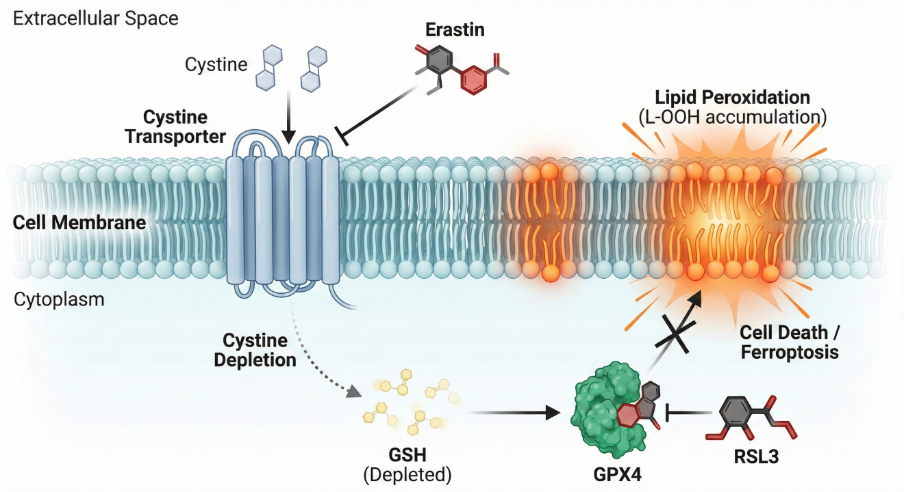
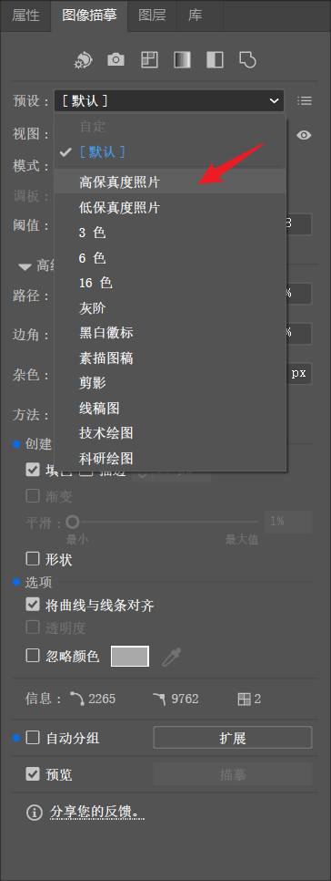
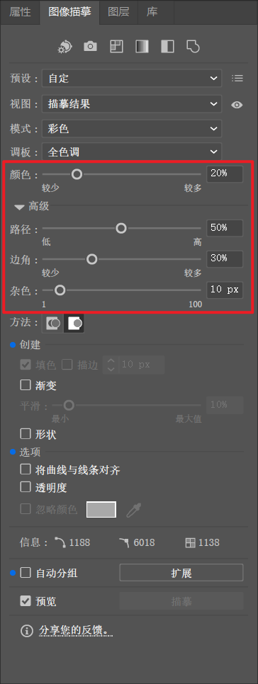
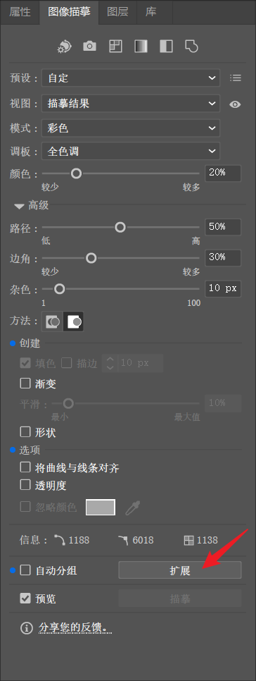
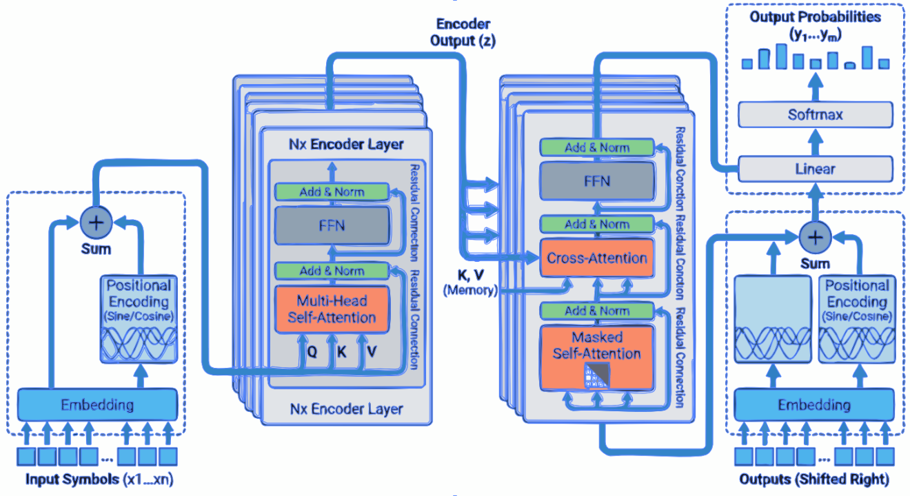

# 附录：AI 科研绘图实战速查手册

本手册集中汇总了教程中涉及的核心工具、跨学科提示词模版、学术合规红线、进阶控图策略以及投稿免责声明模板，方便读者在实际科研绘图过程中快速查阅与复用。

---

## 一、工具速查清单

### 1. 核心 AI 图像生成模型
| 工具名称 | 适用场景 | 说明 / 链接 |
| :--- | :--- | :--- |
| **Nano Banana Pro** | 核心绘图模型 (gemini-3-pro-image-preview) | [Google AI Studio](https://aistudio.google.com/) 调试复杂参数；<br>[Gemini Web端](https://gemini.google.com/) 进行自然语言对话。 |
| **Qwen-image-2.0** | 本土化中文最佳平替 | 擅长中文科研术语捕捉。[通义免费使用](https://chat.qwen.ai/) (选择 Qwen3-Max 生成图像)。 |
| **Lovart / Higgsfield** | 第三方集成化生成平台 | 免配置开箱即用，适合受网络限制、快速生成简单素材的用户。 |

### 2. 前置辅助工具 (草图构建与取色)
| 工具名称 | 适用场景 | 说明 / 链接 |
| :--- | :--- | :--- |
| **Excalidraw / draw.io** | 轻量级草图与拓扑结构绘制 | 绘制逻辑骨架作为图生图(Image-to-Image)的骨架参考。<br>[Excalidraw 在线端](https://excalidraw.com/) \| [draw.io网页版](https://app.diagrams.net/) |
| **PPT / Visio** | 常见形状结构勾勒 | 本地客户端内快速构建论文主体的基础形状布局。 |
| **colorgram.py** | 配色提取工具 (Python开源库) | 辅助从高水平论文插图中提炼稳定审美的提取 HEX 色值。[colorgram.py](https://github.com/obskyr/colorgram.py) |

### 3. 后处理与重构工具 (去水印、放大、矢量化)
| 工具名称 | 适用场景 | 说明 / 链接 |
| :--- | :--- | :--- |
| **gemini-watermark-remover** | 图像去水印 (开源项目) | 通过反向 Alpha 混合算法清理水印，还原基础素材。[GitHub 相关开源仓](https://github.com/GargantuaX/gemini-watermark-remover) |
| **Real-ESRGAN 系列模型** | 高清放大与超分辨率模型 | 在自动描摹前提升低分辨率位图的锐度与细节。[GitHub 项目](https://github.com/xinntao/Real-ESRGAN) |
| **Vectorizer** | 在线基础矢量化 | 快速将位图转化为基础 SVG 文件。[Vectorizer在线版](https://vectorizer.ai/) |
| **Adobe Illustrator / AI** | 专业矢量化“图像描摹” | 高质量转换，支持精细参数调节（推荐设置：颜色20%、路径50%、边角30%）。 |
| **ChemDraw / VESTA** | 分子构型与晶体结构生成 | 化学生生物学必装专业工具，用于生成结构精确的局部模块或组件。 |
| **Matplotlib** | 代码辅助矢量图形绘制 | 适合绘制拥有严格参数控制的科学坐标架构体系。[官方文档](https://matplotlib.org/) |
| **Edit-Banana / Paper2Any**| 基于 VLM/OCR 的结构化生成 | 尝试将静态图表转化为DrawIO等可编辑文件的预研项目。[Edit-Banana](https://github.com/BIT-DataLab/Edit-Banana);[Paper2Any](https://github.com/OpenDCAI/Paper2Any) |

---

## 二、AI 科研绘图的“学术红线”与期刊规范 (🚨 重点防踩坑)

在将 AI 绘图引入论文前，必须明确其适用边界：

### 1. 核心类型分类与可受约束
* **定性数据图（如柱状图、折线图等）**：**严禁 AI 生成内容**，只能用代码辅助（如 Matplotlib、Origin计算生成）。
* **实证影像图（如显微镜照片、电泳图等）**：**严禁 AI 填充或修补去噪**，仅允许线性的亮度与对比度整体调节。
* **定性示意图（如机制图、架构架构图等）**：**限制性允许辅助**，可利用 AI 起草构图与上色参考，但**必须人工矢量化重绘**以保障署名和责任能够追溯！

### 2. 主流国际期刊政策速览

<table> <colgroup> <col style="width: 12%" /> <col style="width: 9%" /> <col style="width: 77%" /> </colgroup> <thead> <tr> <th style="text-align: center;"><strong>期刊/出版集团</strong></th> <th style="text-align: center;"><strong>政策类型</strong></th> <th style="text-align: center;"><strong>官方核心要求</strong></th> </tr> </thead> <tbody> <tr> <td style="text-align: center;"><strong>Nature/ Science</strong></td> <td style="text-align: center;"><strong>完全禁止</strong></td> <td>涵盖所有插图、摄影和视频。除非 AI 本身是研究对象，否则绝对禁止。 （详见 <a href="https://www.nature.com/nature-portfolio/editorial-policies/ai"><u>https://www.nature.com/nature-portfolio/editorial-policies/ai</u></a>与<a href="https://www.science.org/content/page/science-journals-editorial-policies"><u>https://www.science.org/content/page/science-journals-editorial-policies</u></a>）</td> </tr> <tr> <td style="text-align: center;"><strong>Elsevier</strong></td> <td style="text-align: center;"><strong>原则禁止</strong></td> <td>明确禁止在正文图像和图形摘要中使用 AI。仅在封面图上保留了“向编辑申请特许”的机会。 （详见<a href="https://www.elsevier.com/about/policies-and-standards/generative-ai-policies-for-journals">https://www.elsevier.com/about/policies-and-standards/generative-ai-policies-for-journals</a>）</td> </tr> <tr> <td style="text-align: center;"><strong>ACS</strong></td> <td style="text-align: center;"><strong>限制性允许</strong></td> <td>允许用于图像生成，但必须在“致谢”或“方法”部分详细披露工具名称、版本及具体用途。 （详见 <a href="https://researcher-resources.acs.org/publish/aipolicy">https://researcher-resources.acs.org/publish/aipolicy</a>）</td> </tr> <tr> <td style="text-align: center;"><strong>JAMA Network</strong></td> <td style="text-align: center;"><strong>限制性允许</strong></td> <td>禁止 AI 署名。不鼓励提交使用AI 生成的图像。若使用必须披露，且作者必须能为图中每一处细节的真实性提供担保。 （详见<a href="https://jamanetwork.com/journals/jama/pages/instructions-for-authors">https://jamanetwork.com/journals/jama/pages/instructions-for-authors</a>）</td> </tr> </tbody> </table>


---

## 三、投稿免责的英文声明模板 (📝 Copyright Disclosure)

绝大多数允许弱引入 AI 的顶会、顶刊皆将“披露与作者担责”列为铁律。在您基于本文方法完成了定性示意图的修缮、人工排版加字重组与矢量导出后，请在最终投稿的 **Acknowledgment (致谢) 或 Methods (方法)** 章节内附带此类披露声明（直接替换括号内中括号内容）：

> The authors acknowledge the use of **[使用的具体工具，如 Nano Banana Pro]** for the initial conceptualization and color palette selection of Figure **[涉及的图号：X]**. The final figure was **manually redrawn as a vector graphic and verified by the authors** to ensure scientific accuracy and compliance with publication ethics. The authors remain fully accountable for the integrity of the work.

通过上述清晰地界定“AI用于初始构图”和“人类负责重构与事实严谨性把控”，可以在免受退稿退修质疑的同时，合理合规地运用时代红利。

---

## 四、定制化元提示词 (Meta-Prompt)

当通用领域的提示词无法满足你的特定交叉学科需要时，可以利用本提示词，附带你心仪的一张“顶级发表图”（作为视觉参考垫图），让 LLM 为你反向破译并适配你们领域的排版与专用语义，**这是最高效的举一反三法**。

```text
你是一名资深提示词工程专家，熟悉学术论文插图的生成逻辑，对计算机领域以及【你所在的领域名称】领域的研究范式、图示风格与视觉表达均有系统理解。 
 
我将提供一个目标领域插图的成品示例。该示例代表我希望最终生成结果所遵循的整体风格。请你对该示例进行逆向分析，重点关注以下方面：整体布局结构、信息层级组织方式、模块之间的空间关系、配色方案及其在信息表达中的作用、图形元素的抽象程度与表达习惯。 
 
在此基础上，请对下方给定的两个提示词分别进行微调优化，使其在实际使用时，能够稳定生成与示例在视觉风格与表达逻辑上高度一致的插图提示词。 
 
需要注意的是，这两条原始提示词均是为计算机领域论文内容抽取与示意图绘制所设计的。你的任务是将其调整为适用于【你所在的领域名称】的版本。请保持原有提示词的整体结构、步骤逻辑和控制维度，仅结合【你所在的领域名称】常见的图示布局特征、学科语义重点以及视觉表达习惯进行针对性的细化和替换。 
 
最终输出应为两条对应的完整、可直接使用的提示词，其生成结果在风格上与目标示例保持一致，同时在内容表达上自然适配【你所在的领域名称】。 

---  提示词A：  [复制粘贴下方 5.1 计算机科学的“阶段一”完整提示词]  
---  提示词B：  [复制粘贴下方 5.1 计算机科学的“阶段二”完整提示词]
```

---

## 五、领域专属提示词（Prompt）画廊

以下分领域列出了由论文原文推导视觉框架的**逻辑构建阶段**及底层渲染大模型接收的**绘图渲染阶段**的核心完整提示词。

### 1. 计算机科学 (CS) 与机器学习
> **核心特征**：偏向抽象的拓扑结构，强调信息流、网络输入输出关系。

**阶段一：逻辑构建 **

```markdown
# Role 
你是一位 CVPR/NeurIPS 顶会的**视觉架构师**。你的核心能力是将抽象的论文逻辑转化为**具体的、结构化的、几何级的视觉指令**。 
 
# Objective 
阅读我提供的论文内容，输出一份 **[VISUAL SCHEMA]**。这份 Schema 将被直接发送给 AI 绘图模型，因此必须使用**强硬的物理描述**。 
 
# Phase 1: Layout Strategy Selector (关键步骤：布局决策) 
在生成 Schema 之前，请先分析论文逻辑，从以下**布局原型**中选择最合适的一个（或组合）： 
1.  **Linear Pipeline**: 左→右流向 (适合 Data Processing, Encoding-Decoding)。 
2.  **Cyclic/Iterative**: 中心包含循环箭头 (适合 Optimization, RL, Feedback Loops)。 
3.  **Hierarchical Stack**: 上→下或下→上堆叠 (适合 Multiscale features, Tree structures)。 
4.  **Parallel/Dual-Stream**: 上下平行的双流结构 (适合 Multi-modal fusion, Contrastive Learning)。 
5.  **Central Hub**: 一个核心模块连接四周组件 (适合 Agent-Environment, Knowledge Graphs)。 
 
# Phase 2: Schema Generation Rules 
1.  **Dynamic Zoning**: 根据选择的布局，定义 2-5 个物理区域 (Zones)。不要局限于 3 个。 
2.  **Internal Visualization**: 必须定义每个区域内部的“物体” (Icons, Grids, Trees)，禁止使用抽象概念。 
3.  **Explicit Connections**: 如果是循环过程，必须明确描述 "Curved arrow looping back from Zone X to Zone Y"。 
 
# Output Format (The Golden Schema) 
请严格遵守以下 Markdown 结构输出： 
 
---BEGIN PROMPT--- 
 
[Style & Meta-Instructions]  High-fidelity scientific schematic, technical vector illustration, clean white background, distinct boundaries, academic textbook style. High resolution 4k, strictly 2D flat design with subtle isometric elements. 
 
[LAYOUT CONFIGURATION] 
* **Selected Layout**: [例如：Cyclic Iterative Process with 3 Nodes] 
* **Composition Logic**: [例如：A central triangular feedback loop surrounded by input/output panels] 
* **Color Palette**: Professional Pastel (Azure Blue, Slate Grey, Coral Orange, Mint Green). 
 
[ZONE 1: LOCATION - LABEL] 
* **Container**: [形状描述, e.g., Top-Left Panel] 
* **Visual Structure**: [具体描述, e.g., A stack of documents] 
* **Key Text Labels**: "[Text 1]" 
 
[ZONE 2: LOCATION - LABEL] 
* **Container**: [形状描述, e.g., Central Circular Engine] 
* **Visual Structure**: [具体描述, e.g., A clockwise loop connecting 3 internal modules: A (Gear), B (Graph), C (Filter)] 
* **Key Text Labels**: "[Text 2]", "[Text 3]" 
 
[ZONE 3: LOCATION - LABEL]  ... (Add Zone 4/5 if necessary based on layout) 
 
[CONNECTIONS] 
1.  [描述连接线, e.g., A curved dotted arrow looping from Zone 2 back to Zone 1 labeled "Feedback"] 
2.  [描述连接线, e.g., A wide flow arrow from Zone 2 to Zone 3] 
 
---END PROMPT--- 
 
# Input Data 
[论文相关内容]
```

**阶段二：绘图渲染**

```markdown
**Style Reference & Execution Instructions:** 
 
1.  **Art Style (Visio/Illustrator Aesthetic):** 
    Generate a **professional academic architecture diagram** suitable for a top-tier computer science paper (CVPR/NeurIPS). 
    * **Visuals:** Flat vector graphics, distinct geometric shapes, clean thin outlines, and soft pastel fills (Azure Blue, Slate Grey, Coral Orange). 
    * **Layout:** Strictly follow the spatial arrangement defined below. 
    * **Vibe:** Technical, precise, clean white background. NOT hand-drawn, NOT photorealistic, NOT 3D render, NO shadows/shading. 
 
2.  **CRITICAL TEXT CONSTRAINTS (Read Carefully):** 
    * **DO NOT render meta-labels:** Do not write words like "ZONE 1", "LAYOUT CONFIGURATION", "Input", "Output", or "Container" inside the image. These are structural instructions for YOU, not text for the image. 
    * **ONLY render "Key Text Labels":** Only text inside double quotes (e.g., "[Text]") listed under "Key Text Labels" should appear in the diagram. 
    * **Font:** Use a clean, bold Sans-Serif font (like Roboto or Helvetica) for all labels. 
 
3.  **Visual Schema Execution:** 
    Translate the following structural blueprint into the final image: 
 
[[VISUAL SCHEMA]的全部内容]
```

<div align="center">
<table>
  <tr>
    <td align="center"></td>
  </tr>
</table>
Transformer 架构插图初稿
</div>

---

### 2. 材料与化学 (Materials & Chemistry)
> **核心特征**：强调微观物理机制、分子排布、晶格阵型、界面膜及电子流向。

**阶段一：逻辑构建**

```markdown
# Role 
 
你是一位 Nature Materials / Advanced Materials 风格的**科学可视化架构师**。你的核心能力是将材料与化学论文中的结构机制与反应路径，转化为**具体的、结构化的、物理可实现的视觉指令**。 
 
# Objective 
 
阅读我提供的材料或化学论文内容，输出一份 **[VISUAL SCHEMA]**。这份 Schema 将被直接发送给 AI 绘图模型，因此必须使用**严格的物理结构描述与空间指令**。 
 
# Phase 1: Layout Strategy Selector (关键步骤：布局决策) 
 
在生成 Schema 之前，请分析材料体系与机制逻辑，从以下**材料科学布局原型**中选择最合适的一个（或组合）： 
 
1. **Reaction Pathway Linear Flow**: 左→右反应路径（适合电化学反应、催化机理、相转变过程）。 
2. **Solvation or Coordination Cyclic Model**: 中心为配位或溶剂化结构，周围为离子分布。 
3. **Hierarchical Multiscale Structure**: 宏观器件 → 微观结构 → 原子级结构的垂直堆叠。 
4. **Parallel Material Comparison**: 左右或上下对比不同材料体系或不同浓度条件。 
5. **Core–Shell / Interface Hub Model**: 中心为纳米颗粒或晶体核心，外层为壳层或界面结构。 
 
# Phase 2: Schema Generation Rules 
 
1. **Dynamic Zoning** 
   根据选择的布局定义 2–5 个物理区域（Zones）。 
   每个区域必须具有明确空间位置，例如 Left Panel、Central Core、Right Interface。 
 
2. **Internal Visualization** 
   每个区域必须包含具体材料结构对象，例如： 
 
   * 球棍分子模型 
   * 八面体或四面体晶体单元 
   * 分层石墨片结构 
   * 半透明溶剂化壳层 
     禁止使用抽象词汇如“Module”或“System”。 
 
3. **Explicit Connections** 
   必须明确离子迁移、电荷流向或反应方向。 
   使用明确的箭头指令，例如： 
   “A solid arrow indicating Li⁺ diffusion from Zone 1 to Zone 2” 
   “A curved arrow indicating redox cycle around Fe center” 
 
# Output Format (The Golden Schema) 
 
---BEGIN PROMPT--- 
 
[Style & Meta-Instructions] 
High-fidelity materials science schematic, professional academic illustration for Nature Materials. Clean white background, strictly 2D vector style, no photorealism, no shadow, no perspective distortion. Subtle isometric alignment allowed only for crystal lattices. 
 
[LAYOUT CONFIGURATION] 
 
* **Selected Layout**: [例如：Parallel Material Comparison with 4 Zones] 
* **Composition Logic**: [例如：Two material systems placed left and right with central reaction pathway] 
* **Color Palette**: Low-saturation scientific palette (Mint Green for Li⁺, Amber Yellow for Cl⁻, Slate Grey for carbon framework, Soft Purple for transition metal centers). 
 
[ZONE 1: LOCATION - LABEL] 
 
* **Container**: [形状描述, e.g., Left Rectangular Panel] 
* **Visual Structure**: [例如：A crystalline lattice composed of repeating MO₆ octahedra in a grid array] 
* **Key Text Labels**: "[Material Name]" 
 
[ZONE 2: LOCATION - LABEL] 
 
* **Container**: [形状描述, e.g., Central Circular Region] 
* **Visual Structure**: [例如：A core–shell nanoparticle with inner crystalline core and semi-transparent hydrated shell] 
* **Key Text Labels**: "[Process Name]", "[Ion Species]" 
 
[ZONE 3: LOCATION - LABEL] 
... 
 
[CONNECTIONS] 
 
1. A solid directional arrow from Zone 1 to Zone 2 labeled "[Ion Diffusion]" 
2. A curved arrow around central metal atom labeled "[Redox Cycle]" 
 
---END PROMPT--- 
 
# Input Data 
 
[在此处粘贴你的论文内容]
```

**阶段二：绘图渲染**

```markdown
**Style Reference & Execution Instructions:** 
 
1. **Art Style (Nature Materials / Advanced Energy Materials Aesthetic):** 
   Generate a **professional materials science mechanism schematic** suitable for a top-tier materials or chemistry journal. 
 
   * **Visuals:** Strict flat vector illustration, clean geometric shapes, molecular ball-and-stick models, crystal lattice arrays, thin outlines, soft pastel scientific color coding. 
   * **Layout:** Strictly follow the spatial arrangement defined in the provided VISUAL SCHEMA. 
   * **Vibe:** Precise, structural, mechanism-oriented, white background. No photorealism, no shadows, no depth simulation, no perspective distortion. 
 
2. **CRITICAL TEXT CONSTRAINTS:** 
 
   * Do NOT render structural meta-instructions such as "ZONE", "LAYOUT", or "Container". 
   * Only render text that appears inside double quotes under "Key Text Labels". 
   * Use clean bold Sans-Serif font suitable for scientific figures. 
 
3. **Scientific Visual Conventions Enforcement:** 
 
   * Ions must be rendered as solid colored spheres with clear element distinction. 
   * Crystal lattices must appear as periodic repeating geometric units. 
   * Solvation shells must be semi-transparent circular envelopes surrounding ions. 
   * Interfaces must be represented as flat planar boundaries. 
   * Reaction arrows must be clear, directional, and physically interpretable. 
 
4. **Visual Schema Execution:** 
   Translate the following structural blueprint into a final publication-ready materials science schematic: 
 
[在此处直接粘贴 Step 1 生成的 ---BEGIN PROMPT--- ... ---END PROMPT--- 内容（包含方括号内的英文）]
```

<div align="center">
<table>
  <tr>
    <td align="center"></td>
  </tr>
</table>
高浓度水系电解液微观与界面机制示意图
</div>

---

### 3. 生物与医学 (Biology & Medicine)
> 下面展示的提示词适用于 **BioRender 风格**柔色系效果。书中还提到的 **Goodsell 风格**提示词可以通过[定制化元提示词](#四、定制化元提示词-(meta-prompt))的方式自行生成。

**阶段一：逻辑构建**

```markdown
# Role 
 
你是一位 Nature/Cell/Science 顶刊的**资深医学插画师（Medical Illustrator）**。你的核心能力是将复杂的生物医学机制、临床试验设计或分子通路转化为**直观的、符合生物学特征的、出版级视觉指令**。 
 
# Objective 
 
阅读我提供的论文/摘要内容，输出一份 **[VISUAL SCHEMA]**。这份 Schema 将被直接发送给 AI 绘图模型，因此必须使用**精确的生物实体描述**（而非抽象几何形状）。 
 
# Phase 1: Layout Strategy Selector (关键步骤：布局决策) 
 
在生成 Schema 之前，请先分析论文逻辑，从以下**生物医学布局原型**中选择最合适的一个（或组合）： 
 
1. **Signaling Pathway (Linear/Cascade)**: 上→下或左→右流向 (适合信号转导、代谢通路、药物作用机制)。 
2. **Cyclic/Regulatory Loop**: 中心包含循环结构 (适合细胞周期、负反馈调节、病毒复制周期)。 
3. **Anatomical/Spatial Zoom**: 包含宏观到微观的视觉引导 (适合从器官→组织→细胞→分子的跨尺度展示)。 
4. **Comparative/Parallel Groups**: 平行的对照结构 (适合 Case-control study, Wild-type vs Mutant, 治疗组 vs 对照组)。 
5. **Interaction Network**: 核心分子连接周围多靶点 (适合 PPI 网络、多器官相互作用)。 
 
# Phase 2: Schema Generation Rules 
 
1. **Biological Context**: 必须定义背景环境 (Context)，例如：细胞质基质 (Cytosol)、细胞核内 (Nucleus)、突触间隙 (Synaptic cleft) 或 培养皿 (Petri dish)。 
2. **Entity Materialization**: 禁止使用抽象方块代表生物体。必须描述具体形态，例如： 
   - *抽象概念* -> *视觉实体* 
   - Gene -> Double Helix segment 
   - Protein -> 3D folded structure / Surface representation 
   - Cell -> Lipid bilayer sphere with receptors 
3. **Bio-Semantics in Connections**: 箭头的含义必须明确： 
   - Arrow tip ($\rightarrow$) = 促进/激活 (Activation) 
   - Flat tip ($\dashv$) = 抑制/阻断 (Inhibition) 
   - Dotted arrow = 易位/运输 (Translocation/Secretion) 
 
# Output Format (The Golden Schema) 
 
请严格遵守以下 Markdown 结构输出： 
 
---BEGIN PROMPT--- 
 
[Style & Meta-Instructions] 
 
High-fidelity scientific illustration, BioRender style, 3D semi-realistic rendering, smooth lighting, organic textures. Clean white background. High resolution 4k. Distinct cellular compartments. 
 
[LAYOUT CONFIGURATION] 
 
- **Selected Layout**: [例如：Signaling Pathway with Nuclear Translocation] 
- **Composition Logic**: [例如：Split composition: Top half represents the Cell Membrane, Bottom half represents the Nucleus] 
- **Color Palette**: Biomimetic & Distinct (e.g., Lipid Blue, Protein Red, Cytosol Beige, DNA Purple). Focus on contrast for key molecules. 
 
[ZONE 1: LOCATION - CONTEXT] 
 
- **Container**: [环境描述, e.g., Extracellular Space & Lipid Bilayer] 
- **Visual Structure**: [具体实体, e.g., A cross-section of a phospholipid bilayer with embedded Y-shaped transmembrane receptors] 
- **Key Text Labels**: "[Ligand Name]", "[Receptor Name]" 
 
[ZONE 2: LOCATION - CONTEXT] 
 
- **Container**: [环境描述, e.g., Cytoplasm (Intracellular)] 
- **Visual Structure**: [具体实体, e.g., A complex of globular proteins showing phosphorylation sites (small glowing yellow dots)] 
- **Key Text Labels**: "[Protein A]", "[Protein B-PO4]" 
 
[ZONE 3: LOCATION - CONTEXT] 
 
... (Add Zone 4/5 if necessary, e.g., Nucleus) 
 
[CONNECTIONS & INTERACTIONS] 
 
1. [描述反应过程, e.g., A glowing arrow from the Receptor (Zone 1) to Protein A (Zone 2) indicating signal activation] 
2. [描述抑制关系, e.g., A red line with a flat head extending from Drug X to Protein B indicating inhibition] 
3. [描述空间移动, e.g., A dotted swooping arrow showing Protein B moving into the Nucleus (Zone 3)] 
 
---END PROMPT--- 
 
# Input Data 
 
[在此处粘贴你的论文内容]
```

**阶段二：绘图渲染**

```markdown
**Style Reference & Execution Instructions:** 
 
1.  **Art Style (BioRender/Medical Illustration):** 
    Generate a **standard biological pathway diagram** suitable for Cell/Nature. 
    * **Visuals:** Clean vector-like illustrations with **smooth gradients**. 
    * **Shapes:** Rounded, organic forms (soft edges), not sharp geometric blocks. 
    * **Color Palette:** Professional biological pastels (Membrane Beige, DNA Blue, Cytoplasm Pink). 
    * **Vibe:** Educational, clear, textbook-standard. 
 
2.  **CRITICAL TEXT CONSTRAINTS:** 
    * **Legibility:** Labels must be clear and dark on light backgrounds. 
    * **Font:** Arial or Roboto (Bold). 
 
3.  **Visual Schema Execution:** 
    Translate the following structural blueprint into the final image: 
 
[在此处直接粘贴 Step 1 生成的 ---BEGIN PROMPT--- ... ---END PROMPT--- 内容]
```

<div align="center">
<table>
  <tr>
    <td align="center"></td>
  </tr>
</table>
铁死亡诱导机制插图
</div>


---

## 六、高频“局部修改”交互指令 (💬 对话编辑)

拿到带有小瑕疵的成图初稿时，切忌盲目点击“重新生成”，这不仅会破坏已有的良好版式布局，也会累积难以修复的水印层叠。请直接像使唤设计师一样输入以下短指令让 AI 定点修改原始初稿图层：

| **指令名称** | **英文指令**                                                 | **中文指令**                           |
| :----------- | :----------------------------------------------------------- | :------------------------------------- |
| 修改图标     | Change the '*Gear*' icon in the center to a '*Neural Network*' icon | 把中间的*齿轮*换成*神经网络图标*       |
|              | Replace the *robot head* with *a simple document symbol*     | 把*机器人头*换成*文档符号*             |
| 调整颜色     | Make the background of the *left panel pure white* instead of *light blue* | 把*左边面板*的背景改成*纯白*           |
|              | Change the *orange arrows* to *dark grey*                    | 把*橙色箭头*改成*深灰色*               |
| 风格统一     | Make all lines *thinner and cleaner*                         | 让所有线条*更细更清晰*                 |
|              | Remove the *shading effect*, make it *completely flat 2D*    | 去掉阴影效果，做成*完全扁平的 2D 风格* |
| 文字修正     | Correct the text '*ZONNE*' to '*ZONE*'                       | 修正拼写错误，将 *ZONNE* 改为 *ZONE*   |
|              | Remove the text labels                                       | 去掉所有文字标签                       |

---

## 七、进阶控图策略与矢量化方法 (🧩 防崩塌绝招)

针对结构超长超多层的文章配图，请直接放弃“向AI喂一长段指令一次性解决”的幻想。信息过载必将导致几何学错乱甚至逻辑谬误，推荐两套救场打法：

### 1. 复杂图形怎么防崩塌？
* **降维切割 (模块化拆解)**：强制将一条主架构长图拆解为输入端、数据处理流、预测输出端等 3 块子模块（Sub-module）分布单独生成。
* **母图锚定 (垫图约束法)**：选定生成结果中质感最棒的那一张作为**母图**。后续各个拼接积木块生成时，带上这张图走图生图（Image-to-Image），这样拼好的大图不会产生画风突变。

### 2. 拿到成稿后怎么做"矢量化重绘"合规？
生成的原始 PNG 位图无论质量多高，都缺乏**透明图层能力**和**科研独立署名重构过程**，必须选用以下矢量化方法：
| 矢量化路径类型 | 使用工具 | 适用特征与场景 | 后续维护成本 |
| :--- | :--- | :--- | :--- |
| **人工参考重绘底图** | PPT / Visio / [Figma](https://www.figma.com/) | 逻辑清晰硬朗，只需描辅助结构（如各类流程图）。 | 需一次性耗时搭建；后续改动**零成本**极低。 |
| **自动参数阈值描摹** | Illustrator / Vectorizer | 图像清晰呈色块状（不含大量小字）。可在 AI 中进行图像拓展。 | 可能会有路径节点污点，需适量清理。 |
| **VLM语义重建探索** | [Edit-Banana](https://github.com/BIT-DataLab/Edit-Banana)、[Paper2Any](https://github.com/OpenDCAI/Paper2Any) 等研究项目 | 有强结构和流程拓扑表达的图像。将静态画切为一个可调整的节点文件 | 测试阶段，存在概率不稳定。 |

下面针对上表中最常用的两条路径，分别给出实操参考：

#### 路径 A：Figma 人工参考重绘（推荐新手首选）

对于逻辑清晰的流程图和架构图，使用 Figma 以 AI 生成的位图为底稿进行人工矢量重绘是**合规性最强、后续维护成本最低**的方案。完整的操作流程可参考下方视频教程：

> 🎬 [AI生成的图能投SCI吗？手把手教你用 Figma 完美复刻矢量图，稳过审核！](https://www.bilibili.com/video/BV1n1QUBqEi9/?spm_id_from=333.1387.homepage.video_card.click&vd_source=fcb2af388b4fb32ecf25479cc22a25cf)

#### 路径 B：Illustrator 自动描摹（适合扁平色块风格）

如果你熟悉 Illustrator 等专业绘图软件，可以利用其**图像描摹**功能，将位图快速转换为矢量路径。这一方法在色彩边界清晰、风格扁平的插图中效率较高，能够显著缩短初始矢量化时间。

处理完成后，依次点击 **"扩展"** 与 **"取消编组"**，即可对各个矢量对象进行灵活拖动或单独编辑。下图展示了基于推荐参数的图像描摹操作流程与最终效果：

<div align="center">
<table>
  <tr>
    <td align="center"><br>(a)</td>
    <td align="center"><br>(b)</td>
  </tr>
  <tr>
    <td align="center"><br>(c)</td>
    <td align="center"><br>(d)</td>
  </tr>
</table>
Illustrator "图像描摹"面板 (a) 选择高保真度图片 (b) 设置推荐参数 (c) 点击扩展 (d) 点击取消编组
</div>

<div align="center">
<table>
  <tr>
    <td align="center"></td>
  </tr>
</table>
图 3-2 对应的矢量化重构结果
</div>

