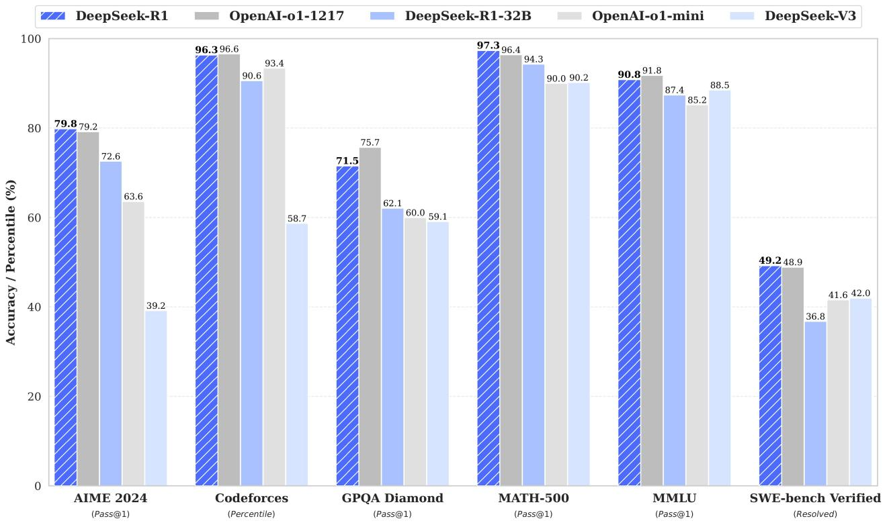
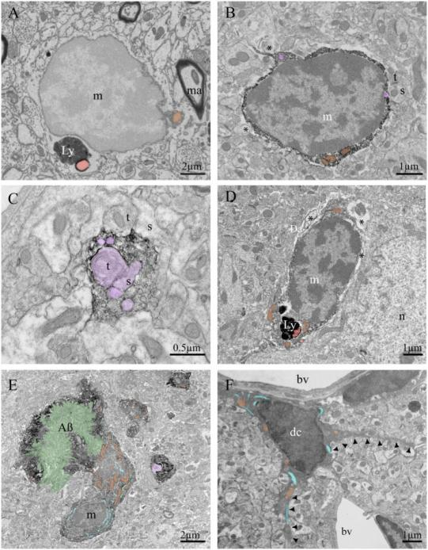
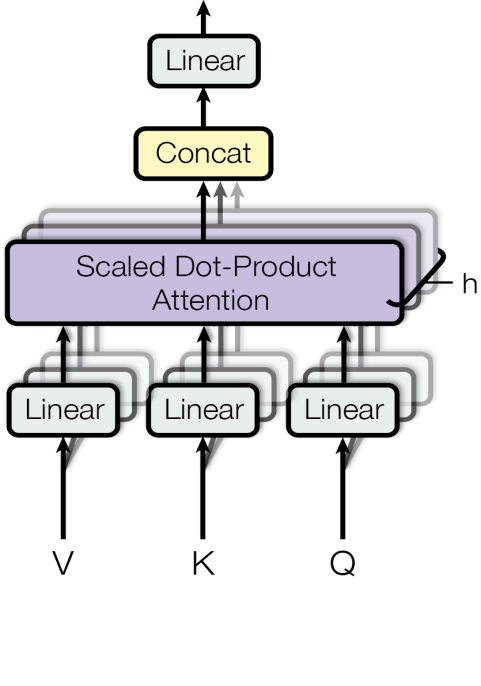
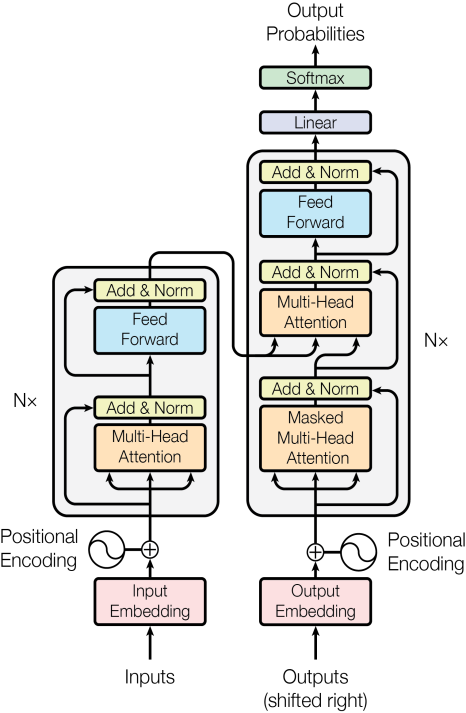
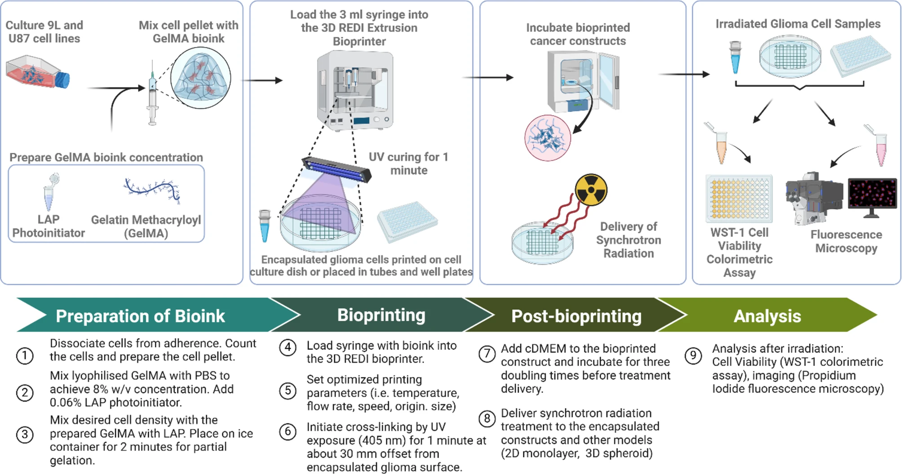
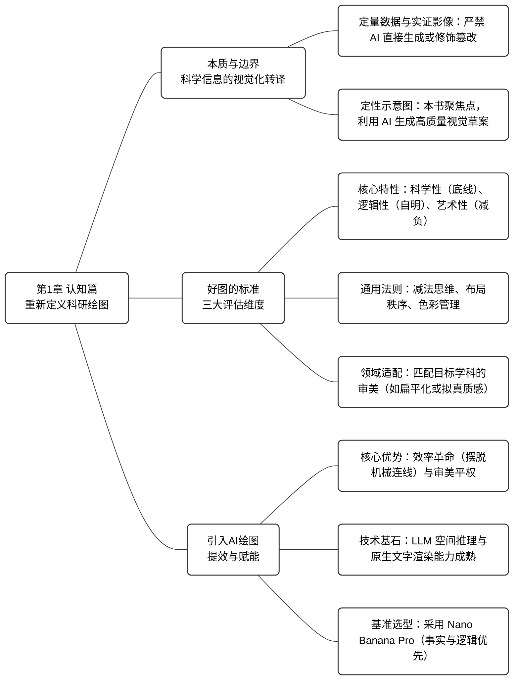

# 第1章 导论：AI时代，科研绘图该怎么做？

> [!NOTE]
> **本章导学**
> - 理解科研插图的三种分类，以及 AI 在其中各自的使用边界
> - 掌握判断一张"好图"的三个核心维度：科学性、逻辑性与艺术性
> - 了解不同学科的视觉偏好，学会用"领域语言"审视自己的插图
> - 明确为什么 Nano Banana Pro 适合科研示意图场景

你有没有这样的经历：实验数据终于跑通，论文逻辑也已理顺，偏偏卡在了插图这一关——PPT 的流程图不够专业，Visio 连线总是对不齐，三维软件又没时间学。更憋屈的是，审稿人要求改动一个模块，整张图可能推倒重来。大量宝贵的科研时间，就这样消耗在了对齐线条和调配色上。

本章将从认知层面重新审视科研绘图。你将看清楚：**哪些图必须亲力亲为，哪些环节可以放心交给 AI**，以及如何用审稿人的眼光去判断一张图的好坏。

## 1.1 科研绘图的本质与边界

科研绘图有别于艺术创作，其本质在于**科学信息的视觉化转译**。

在科研论文中，图表的核心任务在于降低读者的认知负荷，以最高的效率传递科学逻辑。面对种类繁多的图表，科研人员需要建立一个清晰的分类坐标系，这决定了工具的选择和学术伦理的边界。

在实际科研写作中，由于科研领域不同，研究者通常会遇到多种类型的插图。为了明确不同图像的使用边界，这里采用一种工作性的分类方式，将常见科研插图概括为三类。

### 1.1.1 定量数据图

这类图表直接反映实验结果，包含折线图、柱状图、散点图等。其核心特征在于每一个像素点都对应着真实的实验数值。在此类图表中，主流学术期刊普遍不允许使用生成式 AI 直接生成图像内容。AI 的生成机制基于概率预测，产出的数据点往往是基于像素规律的"幻觉"，而非真实数据。正确的做法是继续使用 Python、Origin 等专业软件作图，AI 仅可用于提供配色建议或编写绘图代码。

   
  图 1-1 定量数据图参考图[1]

> [!IMPORTANT]
> **Nature 期刊图像完整性政策**
> 投稿的数字图像必须正确反映原始数据，不允许使用任何会改变数据本质或掩盖原始数据的操纵手段，期刊编辑可能会使用软件检测图像处理，并在需要时要求作者提供原始未处理数据进行审查。（详见：<https://www.nature.com/nature/editorial-policies/image-integrity>。）

### 1.1.2 实证影像图

这类图是实验的直接证据，包括显微镜照片、电泳图、实物装置图等。它们记录客观事实，讲究原真性。此类图像通常不允许进行包括 AI 去噪或放大等生成式填充修改，仅允许全图线性的亮度/对比度调整。

### 1.1.3 定性示意图

这才是本书聚焦的核心领域，也是最耗费科研人员精力的部分。它不依赖具体数值，侧重于表达逻辑、流程、机制和概念，是你脑中科学假说和逻辑推演的具象化。无论是展示细胞信号通路的原理图，还是描述算法模型架构的流程图，亦或是用于吸引眼球的期刊封面，都属于此列。

<table>
  <tr>
    <td align="center"> 图 1-2　实证影像图参考图[2]</td>
    <td align="center"> 图 1-3　定性示意图参考图[3]</td>
  </tr>
</table>

需要明确的是，在当前主流期刊的规范下，即便不涉及数据，AI 直接生成的示意图通常也不宜作为论文终稿直接提交。但这类图像在设计阶段具有极高价值。Nano Banana Pro 能够理解复杂的结构化文本，将抽象逻辑快速转化为高质量的视觉草案，为科研人员提供成熟的构图思路与风格参考，从而显著降低后续人工绘制与修改的时间成本。

## 1.2 什么样的图是"好图"？

主观感觉"好看"不是标准。在同行评审的语境下，一张能被顶刊接收的插图，需要同时满足三个核心维度：**科学性、逻辑性和艺术性**。本节从这三个维度出发，再结合通用美学法则和领域差异，帮你建立一套可操作的评图标准。

### 1.2.1 "好图"的核心特性

1. **科学性是不可逾越的底线**
   
   无论构图多么精致，只要违反基本科学常识，这张图就失去了存在价值。科学性是科研绘图的生命线，同时也是最基础的合格要求。它的核心标准只有一个：诚实。所有视觉表达都必须真实反映数据、模型和实验事实，任何形式的误导都会直接导致失败。

2. **逻辑性决定叙事是否顺畅**
   
   一张好的科研图还需要具备自明性。读者在不阅读正文的情况下，应当能够仅凭图片和图注理解作者的核心表达。这要求图中的信息呈现具有明确的先后顺序，视线流动自然，没有需要反复比对或猜测含义的地方。

> **视觉层级（Visual Hierarchy）**
> 通过位置、大小、对比度和颜色的差异，在图中建立清晰的阅读优先级，引导读者先看到最重要的信息，再逐步关注次要内容。

   当视觉层级清晰时，读者几乎无需刻意思考"该从哪里看起"，理解过程会变得顺畅而低负担。这也是顶级期刊插图往往显得"稳定""专业"的重要原因之一。在这一层面，理性判断尤为重要。通过删减无关装饰、控制背景复杂度、统一配色体系，可以确保视觉注意力始终聚焦在关键路径上，同时弱化次要信息对理解的干扰。

3. **艺术性体现对认知负荷的管理能力**
   
   艺术性是科研绘图中最容易被误解的维度。在科研语境下，它并不等同于装饰或炫技，而是利用视觉心理学规律，降低大脑处理信息的成本。一张让人感到"清晰""舒服"的图，往往源于其顺应了人类感知视觉信息的本能。在这一视角下，艺术性并非装饰性的追求，而是一种高度功能化的设计能力。合理的布局、克制的配色和清晰的结构，最终服务的都是理解效率，而非视觉炫技。

### 1.2.2 科研美学的通用法则：克制与秩序

要实现上述特性，构建具有权威感的科研美学，无论属于哪个学科，都需要遵循一套共通的视觉语法，其核心在于极简和有序。

**首先是减法思维**。在科研绘图中，很多问题并非源于信息不足，而是信息过载。无关背景、装饰性线条和视觉效果会持续消耗读者的注意力，使真正重要的数据被淹没。成熟的科研审美往往体现为克制，当干扰项被移除后，数据本身会自然成为视觉焦点。

> **数据墨水比（Data–Ink Ratio）**
> 图形中用于呈现数据的信息墨水应尽可能占据更高比例，所有不直接承载数据或必要结构的信息元素都应被削减。优秀的可视化应当最大化数据表达，最小化视觉噪声。

在"数据墨水比"的原则下，默认灰色背景、密集网格线、立体阴影和冗余边框都属于典型的低价值元素。它们并不会帮助理解数据，反而会打断读者的视觉注意力。当这些元素被移除后，图形往往会立刻变得清晰而有力量。

**其次是利用布局建立秩序**。顶级期刊的组图之所以看起来整齐而专业，很大程度上源于对人类视觉直觉的充分利用。将相关的实验结果紧密排列，读者会下意识地把它们视为同一组；在不同图板中为同一变量保持一致的颜色或符号，即便不加文字说明，读者也能迅速建立起对应关系。这种通过空间位置和视觉相似性形成的内在秩序，使信息理解几乎不需要额外思考。

> **格式塔原则（Gestalt Principles）**
> 人的大脑天然倾向于把位置接近、形态相似的元素归为一个整体，科研绘图正是借助这一认知规律，在不增加文字负担的情况下完成逻辑表达。

**最后是科学的色彩管理**。颜色是传递数据的载体而非装饰品。传统彩虹色谱因亮度突变容易制造数据幻觉，已被可视化界公认为具有误导性，现代标准推荐使用 Viridis 或 Magma 等感知均匀的色谱。同时，考虑到色觉障碍人群的需求，避免使用红绿配色的组合，转而采用洋红色与绿色搭配，这不仅体现了学术包容性，更在视觉上呈现出更高的对比度与专业感。

> **感知均匀色谱（Perceptually Uniform Colormap）**
> 这类色谱在亮度和颜色变化上更加平滑，不会因为颜色跳变而夸大或掩盖数据差异，从而降低视觉误判的风险。

### 1.2.3 领域风格的定向适配

在掌握通用法则的基础上，我们还需洞察不同学科领域的审美偏好，这决定了你的插图是否具有"圈内人"的味道。目前的顶刊审美主要呈现出两种截然不同的取向。

**一种是偏向物理、计算机与人工智能领域的极简主义风格**。以 CVPR、NeurIPS 会议或 Nature Physics 为代表，这类插图偏好扁平化设计与矢量感。它们多使用低饱和度的莫兰迪色系，线条硬朗清晰，强调拓扑结构与逻辑流的直接表达，排斥不必要的三维渲染与光影修饰。

   
  图 1-4 计算机领域插图风格[3]

**另一种则是偏向生物、医学与材料科学的拟真风格**。以 Nature、Science 或 Cell 为代表，这类插图更青睐三维质感与真实环境的复现。它们强调微观细节的丰富度，常利用环境光遮蔽（AO）与次表面散射（SSS)等渲染技术来模拟细胞、蛋白质或纳米材料的真实质感，通过极强的视觉冲击力来营造沉浸式的微观世界。

   
  图 1-5 生物医学领域插图风格[4]

理解并对齐这两种审美取向，能让你的插图瞬间获得审稿人的专业认同，从而在同行评审中占据先机。

## 1.3 为什么选择 AI 绘图？

你或许还在犹豫：传统的 PPT 和 Visio 虽然慢，但也够用，真的有必要引入 AI 吗？即便不考虑最终成稿，单纯从设计与迭代效率的角度看，这一步改变就已经非常值得。其实单纯为了效率，这点改变就完全值得。回想一下，以前为了画一张复杂的神经网络架构图，半天的时间很容易就搭进去了。而现在利用 AI，输入指令后几分钟就能得到多种方案。这能让你从繁琐的"对齐、连线"中解脱出来，腾出更多精力去关注论文逻辑与实验本身。

除了快，AI 绘图还解决了一个让很多科研人员头疼的硬伤：**审美**。

科研工作者往往具备顶级的逻辑思维，知道图里该有什么，但未必懂得如何让它"好看"。布局怎么摆才平衡？配色怎么搭才高级？这些设计层面的短板，往往导致我们画出来的图虽然科学性达标，但视觉效果总觉得差点意思。AI 的介入，相当于给你配备了一位中上水平甚至是顶级的专业设计师。你只负责提供科学逻辑，剩下的配色、光影和排版工作，统统交给它。它能帮助你将一张草图瞬间渲染出顶级期刊封面的质感，让你不再因为配图质量而处于劣势。

当然，要让科研工作者真正放心地将绘图任务交付给 AI，前提是工具必须具备极高的可信度与精确性。得益于两次关键的技术突破，现在的 AI 绘图终于具备了这种"科研级"的可行性。

### 1.3.1 LLM 语义理解与空间逻辑的质变

早期 AI 往往只能通过简单的关键词"概率性猜测"画面，容易导致结构崩坏或逻辑错乱。而新一代模型背后都有强大的大语言模型（LLM）作为支撑，这让 AI 从"画师"进化为了"工程师"——它开始具备复杂的因果推理能力。当你输入"A 包含 B，且 B 指向 C"时，高级 AI 不再是元素的随机堆砌，而是像一位严谨的理工科学生，先构建准确的逻辑拓扑，再进行视觉渲染。这意味着，我们终于可以用自然语言实现对图像结构的精确控制。

### 1.3.2 文字渲染能力的成熟

这为 AI 科研绘图补上了最后一块拼图。过去，AI 极不擅长处理画面中的字符，总是生成一堆不可读的乱码，导致我们生成的图表必须去PS 里进行繁琐的二次加工。而现在，像 Z-Image、Nano Banana Pro 等先进模型已经具备了原生的文字理解与生成能力。它们不仅能实现图文的完美融合，甚至被用户直接用来生成电影海报、带有精准对白的四格漫画，乃至复杂的项目架构图和带标注的科研图表。

### 1.3.3 为什么 Nano Banana Pro 是科研场景的首选？

市面上 AI 工具众多，Midjourney 侧重艺术美感但难以精确控制，Stable Diffusion 虽然强大但上手门槛较高。Nano Banana Pro 之所以脱颖而出，是因为它具备独特的"理工科逻辑思维"。它不仅能精准解析晦涩的科研术语与复杂的空间指令，更遵循事实优先原则，极好地克制了纯艺术类 AI 那种天马行空的随意发挥（幻觉）。这使得它在处理拓扑结构、生化通路及流程图等高逻辑密度的图像时游刃有余，而这正是科研示意图的主战场。

## 1.4 小结

> [!TIP]
> **本章核心结论速查**
> - **定量数据图 / 实证影像图**：不能用 AI 生成，只能用代码或专业软件处理
> - **定性示意图**：AI 最能发挥价值的地方，也是本教程的核心场景
> - 评价一张图：先看科学性（诚实），再看逻辑性（自明），最后看艺术性（低认知负荷）
> - 不同学科有各自的"视觉语言"，提前对齐能让审稿人产生专业认同感

图 1-6 将本章的核心认知体系整理为了一张全景式的知识脉络图：

  图 1-6　第 01 章知识脉络图

**认知决定高度，工具决定效率。** 建立了这套评图标准之后，下一步就是找到合适的工具。[第 2 章 →](../chapter2/) 将正式进入工具篇，带你上手 Nano-Banana Pro 的各种接入方式与核心功能。

# 参考文献

\[1\] DeepSeek-R1. DeepSeek-R1 benchmark comparison figure\[EB/OL\]. (2025-1-20)\[2026-01-24\]. <https://github.com/deepseek-ai/DeepSeek-R1/blob/main/figures/benchmark.jpg>.

\[2\] Savage J C, Picard K, González-Ibáñez F, et al. A brief history of microglial ultrastructure: distinctive features, phenotypes, and functions discovered over the past 60 years by electron microscopy\[J\]. Frontiers in immunology, 2018, 9: 803.

\[3\] Vaswani A, Shazeer N, Parmar N, et al. Attention is all you need\[J\]. Advances in neural information processing systems, 2017, 30.