# 第2章 工具速查：如何零代码接入与使用 Nano-Banana？

> [!NOTE]
> **本章导学**
> - 了解 **Nano-Banana Pro** 的多种官方及第三方接入方式
> - 掌握 **Gemini 网页端**使用 **Pro 模型**的两步法操作
> - 区分**文生图**与**图生图**的核心功能，理解"**伪代码**"提示词与"**草图骨架**"思维
> - 构建一套完整且顺手的科研绘图上下游工具链

在导论中，我们已经建立了关于科研绘图的认知基础，厘清了科研插图的主要类型，并明确了什么样的图才称得上是一张合格甚至优秀的科研绘图。同时，我们也论证了在当前技术条件下，引入 AI，尤其是将其用于定性示意图这一高频、高消耗环节，具有现实且可行的价值。

从本章开始，重心将从理念转向工具。本章的目标在于帮助你快速理解并上手以 Nano-Banana Pro 为代表的核心模型，并补齐在完整科研绘图流程中，生成前准备与生成后处理阶段可能会用到的关键工具，为后续学习方法论与动手实践做好铺垫。

## 2.1 模型接入方式与前沿拓展

在 Google 官方体系中，Nano-Banana Pro 对应的模型名称为 gemini-3-pro-image-preview。围绕该模型，目前存在多种不同形态的使用方式，它们共享同一底层模型能力。

从使用渠道的角度来看，Nano-Banana Pro 的接入方式可以归纳为官方渠道和第三方渠道两种。其中，官方渠道内部又包含 API、可视化实验平台与网页端产品等不同入口。需要说明的是，这几种方式并非相互替代关系，而是同一模型的不同使用入口。它们在是否需要编程、参数控制粒度以及适用阶段上存在差异，但都可以作为科研绘图流程中的有效工具。理解这些方式之间的定位差异，会有助于你在实际使用中选择更合适的接入路径。此外，考虑到中文语义理解与接入便利性的独特优势，我们也推荐将 Qwen-image-2.0 作为一种具备互补价值性选择（详见 2.1.3 节）。

### 2.1.1 官方渠道

官方渠道是模型能力最直接的来源，也是所有第三方平台和中转服务的底层基础。在官方渠道内，Nano Banana Pro 提供了多种使用方式，分别面向不同程度的控制需求与使用场景。表 2-1　整理了官方渠道内 Nano Banana Pro三种典型方式的优缺点及适用对象。

**表 2-1** 官方渠道内 Nano-Banana Pro 三种典型使用方式的优缺点及适用对象

| **使用方式** | **优点** | **缺点** | **适用对象** |
| :--- | :--- | :--- | :--- |
| 官方 API | • 版本更新最及时，规则最清晰；<br>• 支持批量化生成；<br>• 易于集成到 Python 脚本或科研工作流中 | • 需要具备一定的编程基础；<br>• 需要配置 Google Cloud 计费账户。 | 希望构建可复用工作流或批量处理图像的科研人员 |
| Google AI Studio | • 无需写代码即可调整参数（尺寸、分辨率等）；<br>• 适合探索模型能力边界和调试复杂提示词 | • 并非免费，底层依赖 API 计费；<br>• 需要配置计费账户 | 不想写代码，但需要比网页端更丰富的参数控制权 |
| Gemini 网页端 | • 学习成本最低，自然语言对话即可生成；<br>• 交互简单直观 | • 可控性相对有限；<br>• 参数精细度不如前两者；<br>• 受限于订阅等级的每日额度 | 希望以最低学习成本快速体验的用户 |


> **1. 官方 API**

使用官方 API ，是最标准、最底层的使用方式。完整流程通常是通过 Google 官方平台 Google AI Studio 申请访问权限，获取 API Key，并为项目配置计费账户。完成上述步骤后，即可参考官方文档在代码中直接调用图像生成接口。

它的核心优势在于模型版本更新最及时，规则最清晰。这种方式非常适合具备一定编程基础、希望将绘图能力纳入可复用科研工作流的科研人员。你可以将图像生成功能集成到自己的 Python 脚本中，实现批量化生成或构建可复用的科研绘图工作流。实际上，市面上绝大多数第三方工具，其底层调用的正是这一接口。

> **2. Google AI Studio**

Google AI Studio 是 Google 提供的官方可视化实验与调试平台。如果你不想写代码，但又希望获得比普通网页端更丰富的参数控制权，Google AI Studio 是最佳选择。在 AI Studio 的 Playground 界面中，在选择了 Nano-Banana Pro 模型后，可以通过交互式界面直接输入提示词并生成图片。图 2-1　展示了 Google AI Studio 的使用界面。

<div align="center">
  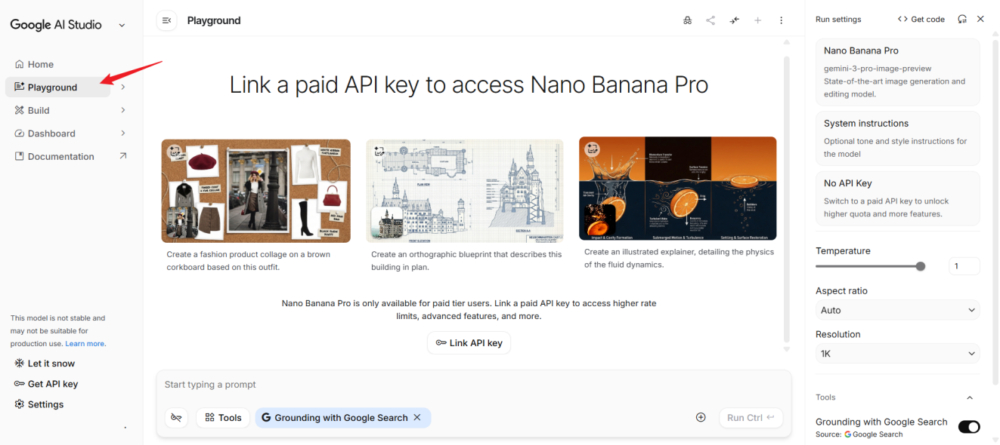<br>
  图 2-1　Google AI Studio 的使用界面
</div>

需要注意的是，这种方式并非免费使用。其底层依然依赖来自 Google AI Studio 的 API Key，并要求项目已配置计费账户，与官方 API 调用在计费层面保持一致。相比于写代码，它允许你通过图形界面直接调整尺寸、分辨率等参数，更适合用于在项目正式工程化之前探索模型能力边界、调试复杂提示词结构。

> **3. Gemini 网页端**

对于希望以最低使用成本快速体验 Nano-Banana Pro 生成能力的科研人员来说，Gemini 网页端提供了最直接的入口。

需要特别注意的是，在目前的 Gemini 网页界面中，直接通过对话生成的图像默认由最新的 Nano Banana 2 模型（官方名称为 Gemini 3 Flash Image）提供支持。使用 Pro 模型，流程分为两步：首先，在“工具”中选择“制作图片”并通过对话窗口输入提示词生成初始图片；随后，点击生成图片下方的“更多”图标（三个点），并选择“使用 Pro 重新生成”，即可调用 Nano-Banana Pro 获得细节更丰富的科学插图。图 2-2　展示的是 Gemini 网页端中使用 Nano-Banana Pro 的具体流程。这一方式的学习成本最低，但在可控性与参数精细度上相对有限。

<div align="center">
<table>
  <tr>
    <td align="center">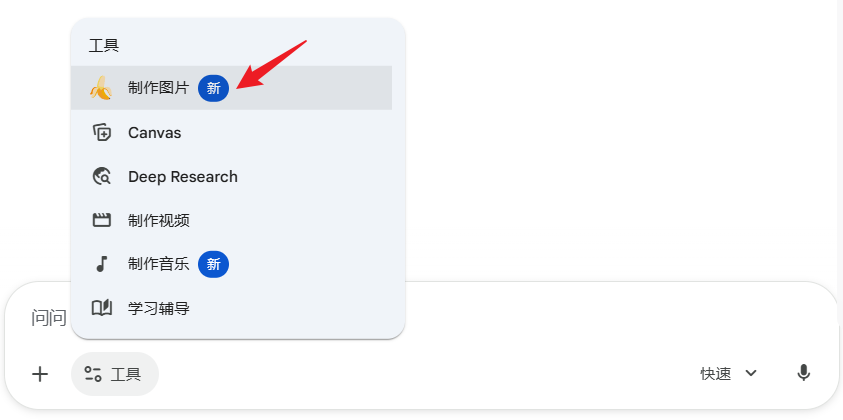<br>(a)</td>
    <td align="center">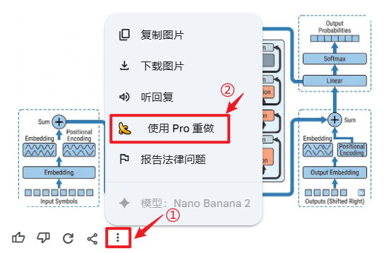<br>(b)</td>
  </tr>
</table>
图 2-2　Gemini 网页端中使用 Nano-Banana Pro 的方式 (a) 选择“制作图片”并通过对话窗口输入提示词生成初始图片 (b) 点击生成图片下方的“更多”图标，并选择“使用 Pro 重新生成”
</div>

值得一提的是，默认的 Nano Banana 2 在科研绘图上同样表现不俗，尤其在生成速度、文字的准确渲染上具有独特优势。但在整体视觉质感、复杂细节的严谨度，与 Pro 模型仍存在一定差距。你可以根据实际需求灵活选择是否消耗额度使用 Pro 进行重绘。

根据 Gemini 官方帮助文档中关于图片生成与编辑功能的说明，目前的 Google AI 方案决定了你的每日生成额度和图片画质。Gemini 网页端不同 Google AI方案的权益对比如表 2-2　所示。（详见https://support.google.com/gemini/answer/16275805　以及　https://support.google.com/gemini/answer/14286560）

**表 2-2** Gemini 网页端不同 Google AI 方案的权益对比

| **方案** | **每日生成额度** | **图片画质 (下载分辨率)** | **Nano-Banana Pro 访问权限** | **备注** |
| :--- | :--- | :--- | :--- | :--- |
| Gemini 基础版 | 不支持 | 1K | 仅限 Nano-Banana 2 | 未订阅 Google AI 方案 |
| Google AI Plus | 50 次 | 2K | 支持 | 可将 Nano-Banana 2 生成结果使用 Pro 重新生成 |
| Google AI Pro | 100 次 | 2K | 支持 | 拥有更高额度 |
| Google AI Ultra | 1000 次 | 2K | 支持 | 适合高频使用需求 |


> 有两点需要说明。一个是上述额度每日重置。由于图像生成需求量较大，具体限制可能随
> Google 策略调整而变化。另一个是表 2-2　仅展示与“图像生成”相关的权益差异。
> 不同方案在其余方面亦存在显著区别，具体请以官方最新定价说明为准。

### 2.1.2 第三方渠道

虽然官方渠道提供了最权威的支持，但受限于网络环境稳定性、跨境支付门槛或官方配额策略，许多科研人员在实际操作中面临障碍。为了解决这些“最后一公里”的问题，市场上衍生出了多种第三方解决方案。这些渠道在易用性和成本上各有侧重，但也伴随着不同程度的风险。

表 2-3　对比了两种主要的第三方渠道的使用方式，你可以根据自身的技术背景与数据安全需求做出选择。

**表 2-3** 两种主要的第三方渠道的使用方式对比

| **使用方式** | **优点** | **缺点** | **适用对象** | **典型示例** |
| :--- | :--- | :--- | :--- | :--- |
| 集成化第三方平台 | • 无需配置 API Key 或网络环境；<br>• 界面友好，操作简单 | • "黑盒"调用，参数不可见；<br>• 提示词长度常受限，不利于复杂科研绘图 | 受网络或支付限制，或仅需快速生成简单素材的用户 | Lovart、Higgsfield 等在线设计工具 |
| 第三方中转 API | • 代码逻辑大多与官方一致；<br>• 单价通常较低 | • 稳定性差，完全依赖服务商；<br>• 存在严重的数据隐私泄露风险 | 有批量化需求且希望降低成本或简化支付流程，且数据非敏感的科研人员 | 各类 API 分发商/中转服务 |

**1. 集成化第三方平台**

集成化第三方平台的特点是“开箱即用”。你不需要配置 API Key，也不用担心网络连接，面对的是一个封装好的设计网站。

Lovart 是一个典型例子。如图 2-3　所示，用户在平台中看到的是一键生成的设计流程，其底层可能调用 Nano-Banana Pro，也可能根据具体场景切换至其他模型。Higgsfield 以及其他可通过搜索引擎找到的在线生成工具，同样属于这一范畴。

<div align="center">
  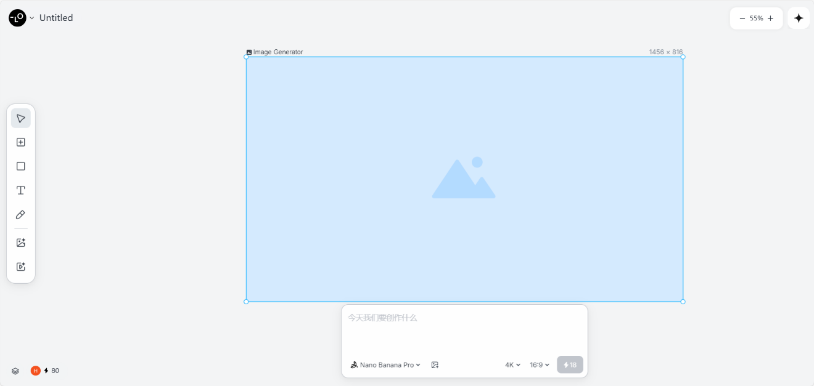<br>
  图 2-3　Lovart 中使用 Nano-Banana Pro 的操作界面
</div>

这类平台通常通过自身的账号体系限制每日生成次数。模型具体的参数设置与调用路径对用户而言是不可见的。

> [!TIP]
> **本书建议**：在选择第三方平台时需特别注意，部分平台会对提示词长度施加较严格的限制。而在生成科研论文插图初稿时，Nano-Banana Pro 往往需要较长、结构化程度较高的提示词，这在实际使用中可能构成明显约束。

**2.第三方中转 API**

第三方中转 API 是部分熟悉代码的科研人员常用的折中方案。

这种模式下，用户在代码中配置的不再是 Google 官方地址，而是第三方提供的接口地址。服务商负责将你的请求转发至官方 Nano-Banana Pro 接口，并按量计费。从代码层面看，第三方中转 API 的调用方式通常与官方 API 高度一致，仅在接口地址和模型名称上存在差异，但具体细节应参考对应服务商的说明文档。

这类中转服务的 API 单价通常低于 Google 官方定价，主要通过批量采购或混合路由策略实现，但其稳定性往往取决于具体的路由策略。

但是必须要注意的是，市面上部分定价极低甚至免费的 API 服务，可能通过逆向工程等非正规手段实现。这不仅意味着服务随时可能中断（稳定性差），更重要的是，你的科研数据（即 Prompt 中的实验设计或创新点）经过了不可控的第三方服务器。

> [!WARNING]
> **本书建议**：在处理尚未发表的敏感科研数据时，谨慎评估此类服务的安全性，并优先选择官方渠道。

### 2.1.3 Qwen-image-2.0使用渠道

2026年2月，阿里云通义团队正式发布了新一代 AI绘图模型 [Qwen-image-2.0](https://chat.qwen.ai/)。尽管本书的方法论主要围绕 Nano-Banana Pro 展开，但其底层逻辑对于同类高水平模型同样适用。经测试，Qwen-image-2.0 在处理含有特定中文科研术语的提示词时，往往具备更敏锐的捕捉能力，同时也为国内科研人员提供了更稳定的访问体验。

图 2-4　展示了 Qwen-image-2.0 的使用方式 。这种方式无需复杂的配置，适合用于快速验证灵感或在 Nano-Banana Pro 无法准确理解中文指令时进行辅助生成。

<div align="center">
<table>
  <tr>
    <td align="center">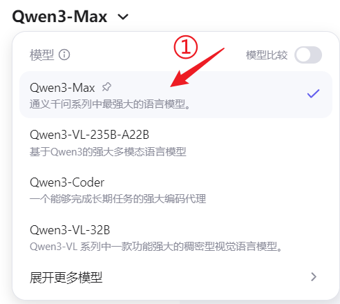<br>(a)</td>
    <td align="center">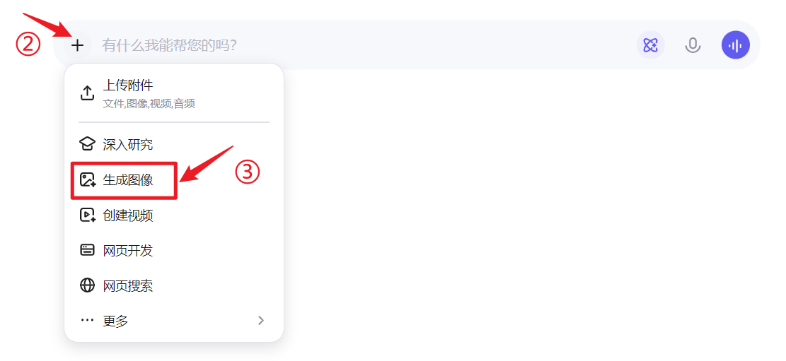<br>(b)</td>
  </tr>
  <tr>
    <td colspan="2" align="center">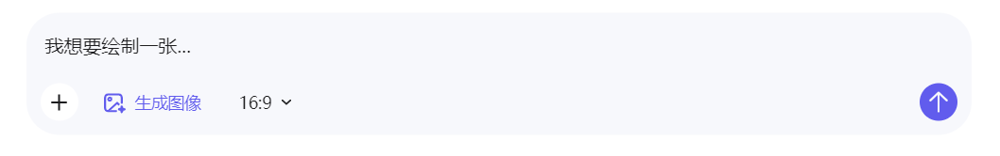<br>(c)</td>
  </tr>
</table>
图 2-4　Qwen-image-2.0 的使用方式 (a) 选择模型 (b) 选择“生成图像” (c) 描述图像内容
</div>

> [!NOTE]
> **本书实战环境说明**
> 引入 Qwen-image-2.0 的初衷，是为国内科研人员提供一个稳定、无障碍且懂中文的优质平替方案。为了保证全书教学逻辑的前后连贯，本书后文的实战案例与提示词模板均以 Nano-Banana Pro作为演示，但本书的方法是跨模型通用的，后续的方法论均可无缝迁移到 Qwen-image-2.0 中，只需将原本的英文指令翻译为对应的中文描述即可，本书后续将不再对双模型进行重复对比演示。

## 2.2 Nano-Banana Pro 核心功能解构

在了解了如何“打开”这个工具后，下一步便是理解它在科研绘图流程中究竟承担怎样的职能角色。

与以审美驱动为核心的图像生成模型不同，Nano-Banana Pro 在科研场景中的定位，更接近一位能够理解结构、约束和因果关系的工程协作者。它并不追求自由发挥，而是擅长在明确规则下完成视觉构建。

这也决定了使用它的核心方式并不复杂。你不需要成为提示词专家，只需要掌握两种足以覆盖绝大多数科研绘图场景的对话模式：结构化生成的文生图，以及引入视觉约束的图生图。

### 2.2.1 文生图

在科研绘图中，最需要警惕的是 AI 的随意发挥。因此，我们需要尽量减少模型的自由想象空间，将其严格约束在明确的目标边界内。当你输入“画一个神经网络”时，许多传统图像模型往往会返回一张充满科技感却逻辑松散的插画。而 Nano-Banana Pro 的优势在于，它能够理解“结构化指令”。这一能力正是第 03 章将重点介绍的“逻辑构建”思维的基础。接下来将介绍文生图的两个技巧。

**1. 像写伪代码一样写提示词**

为了实现对图像的精准控制，本书不建议使用散文式的自然语言描述，而是推荐**采用一种模块化、分层级的指令组织方式**。用户可以显式地向模型声明绘图的关键约束条件，如整体风格、空间布局、拓扑关系。

- **整体风格**：明确图像更接近哪一类期刊的视觉审美标准，例如 “CVPR
  偏好的扁平化风格”“ Nature 常见的拟真风格”。

- **空间布局**：定义画面的物理分区与层级关系，例如“左侧为输入层，中间为处理层，右侧为输出层”。

-  **拓扑关系**：明确组件之间的连接方式与方向，例如“箭头 A 从区域 1
  指向区域 2，并形成闭环结构”。

这种高度逻辑化的输入方式，可以在很大程度上抑制模型的幻觉行为，确保生成结果在科学逻辑上是自洽的。

此外，需要补充的是，尽管 Nano-Banana Pro 具备良好的中文理解能力，在涉及复杂结构约束与多层逻辑描述时，英文提示词在精确度与稳定性上仍更具优势。

> [!TIP]
> **本书建议**：在跟随本书使用 Nano-Banana Pro 进行实战时，优先使用英文撰写核心绘图指令。如有将图中文字或说明转为中文的需求，可在后期编辑阶段统一处理（若使用前文提及的 Qwen-image-2.0 等中文原生模型，则不受此语言限制）。

**2. 参数化控色**

文生图中的另一个关键技巧，是对色彩的参数化控制。 科研插图通常对色彩风格有较为严格的隐性规范，例如 Nature、Science 等期刊常见低饱和度、弱对比度的配色方案。仅使用“蓝色”“红色”等模糊描述，往往会得到过于鲜艳、缺乏专业质感的结果。

在 Nano-Banana Pro 中，你可以直接在提示词中**指定** **HEX 色值**，例如 `Primary Color: Azure Blue #E1F5FE`。模型能够准确解析这些颜色参数，从而生成符合主流顶级期刊审美的图像，有效规避常见的“塑料感”问题。

为了更直观地展示上述两种技巧的效果，本节尝试复刻图 1-3，即多头注意力机制原理示意图。下面对比两种不同提示词方式所生成的结果。

<div align="center">
<table>
  <tr>
    <td align="center">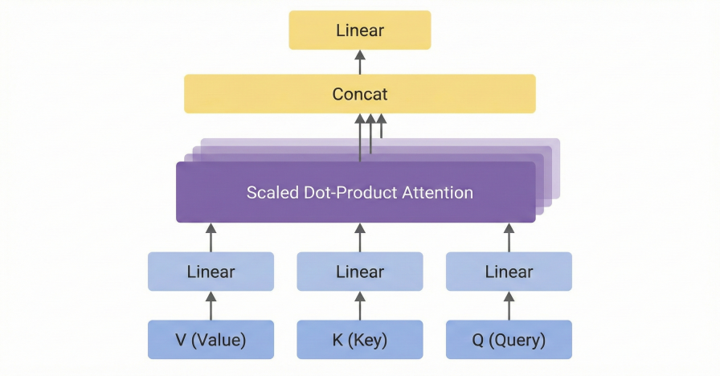<br>图 2-5　自然语言提示词生成图像</td>
    <td align="center">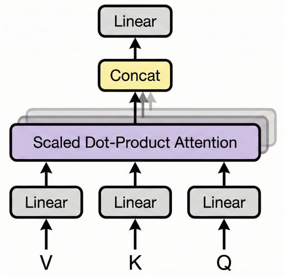<br>图 2-6　结构化提示词生成图像</td>
  </tr>
</table>
</div>

通过对比可以发现，图 2-5 仅完成了基本结构的还原，在风格一致性与细节表达上仍存在明显不足；而图 2-6 所使用的提示词，已经在较高程度上复现了目标期刊示意图的视觉语言，整体还原度约可达到 80% 左右。

最后需要说明的是，不必担心自己无法直接编写出如此细致的提示词。在实际工作流程中，提示词的初稿完全可以借助大语言模型自动生成，第 03 章将系统介绍相关方法。

### 2.2.2 图生图

尽管文字描述具有很强的表达能力，但在面对复杂空间结构时，例如多层嵌套的模型架构或复杂的分子结构，语言本身往往显得力不从心。

此时，引入参考图将成为决定体验上限的关键。它并不仅仅是一个辅助选项，更是科研绘图从可用迈向好用的重要分界点。具体而言，**参考图主要承担两种核心功能：提供空间拓扑的结构骨架，以及定义视觉特征的目标风格**。

**1. 草图即骨架**

你并不需要具备专业的绘画能力。无论是用鼠标在画图工具中随手勾勒的线条，在 PPT 中粗略摆放的框架，还是在纸上快速画下的草图，只要其拓扑结构是正确的，即明确了谁与谁相邻、谁指向谁，Nano-Banana Pro 就可以将其视为整个画面的“骨架”。

通过上传这样的参考图，原本抽象而冗长的文字描述便获得了清晰的空间约束。模型会保留草图中的结构关系，同时对线条、配色和质感进行系统化优化。总体而言，一张结构正确但外观粗糙的草图，往往胜过冗长且难以精确约束空间关系的文字描述。

同样以复刻图 1-3 为例。上传图 2-7，即手绘草图，并使用如下提示词，就能得到图 2-8 所示的结果。

该例所使用的提示词如下：
```markdown
[Structural Constraint] 
- Preserve all components and connections from Image 
- Do not add or remove any elements 
  
[Style & Color Enforcement] 
- Visual Style: CVPR / NeurIPS academic schematic 
- Rendering: 2D flat vector, clean and minimal 
- Background: Pure White (#FFFFFF) 
  
- Color Scheme: 
  * Inputs and Linear layers: Light Grey (#E0E0E0) 
  * Attention core: Pastel Purple (#D1C4E9) 
  * Concat layer: Pastel Yellow (#FFF59D)
```
<div align="center">
<table>
  <tr>
    <td align="center">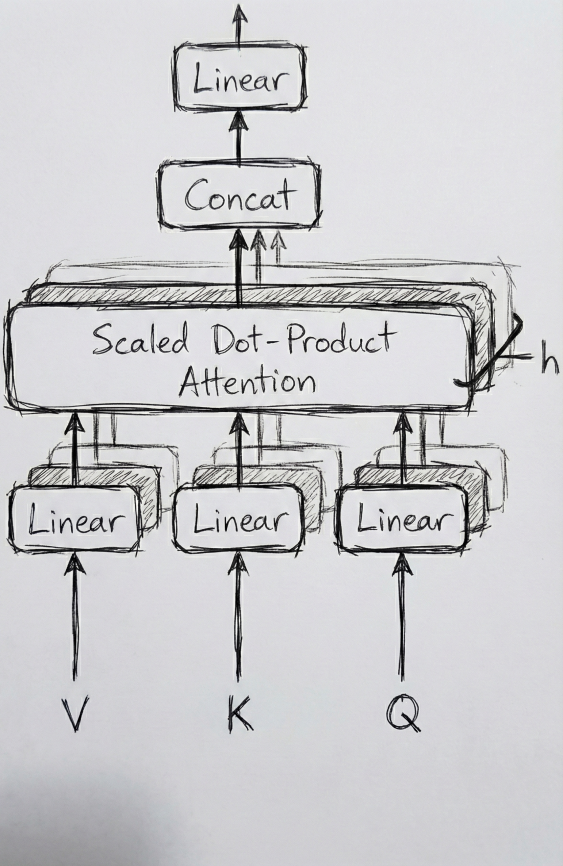<br>图 2-7　手绘草图</td>
    <td align="center">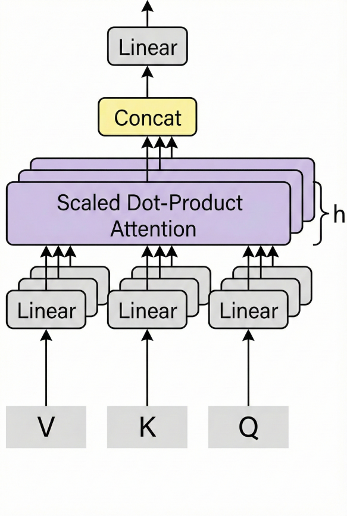<br>图 2-8　使用草图生成图像</td>
  </tr>
</table>
</div>

可以看到，该版本在细节上的还原度明显高于仅依赖结构化文字描述的结果。这组提示词几乎没有涉及逻辑关系的描述，而是专注于配色方案与整体风格的约束。原本需要反复书写的连接关系，被草图以更低成本的方式准确表达出来。

**2. 风格迁移与对齐**

除了结构参考，图生图模式还可以用于风格迁移。当你在阅读文献时，遇到配色、线条与整体质感都高度符合目标期刊风格的插图，可以将其作为风格上的参考图提供给模型。

在这种情况下，模型会主动放弃默认的渲染习惯，转而对齐参考图的视觉特征，例如线条粗细、配色方案与整体的扁平化程度，从而快速生成在视觉语言上与目标期刊高度一致的科研插图。

在下面的案例中，我们选择与图 1-3　来自同一篇文章的图 2-9　作为风格参考，并通过相应提示词生成图 2-10。该例所使用的提示词如下：
```markdown
[Layout Constraints] 
* Type: Vertical Stack (Bottom-up Flow) 
* Background: Pure White, No Shadow 

[Zone 1: Inputs (Bottom)] 

- Objects: Three labels "V", "K", "Q" arranged horizontally 
- Connection: Arrows pointing upward to Zone 2 

[Zone 2: Linear Projections] 

- Shape: 3 small rounded rectangles arranged horizontally 
- Label: "Linear" inside each box 
- Outline: 2px solid outline 

[Zone 3: The Multi-Head Core (Middle)] 

- Main Object: A wide rectangle labeled "Scaled Dot-Product Attention" 
- Visual Effect: Stacked layers to represent multiple heads 
- Connection: Receiving arrows from Zone 2 

[Zone 4: Output Processing (Top)] 

- Object A: A rectangle labeled "Concat" 
- Object B: A rectangle labeled "Linear" 
- Layout: Object B is placed above Object A 

[Rendering Notes] 

- Use the provided reference image for visual language only 
- Layout and structure must strictly follow the constraints above
```
<div align="center">
<table>
  <tr>
    <td align="center"><br>图 2-9　提供的风格参考图<sup>[3]</sup></td>
    <td align="center">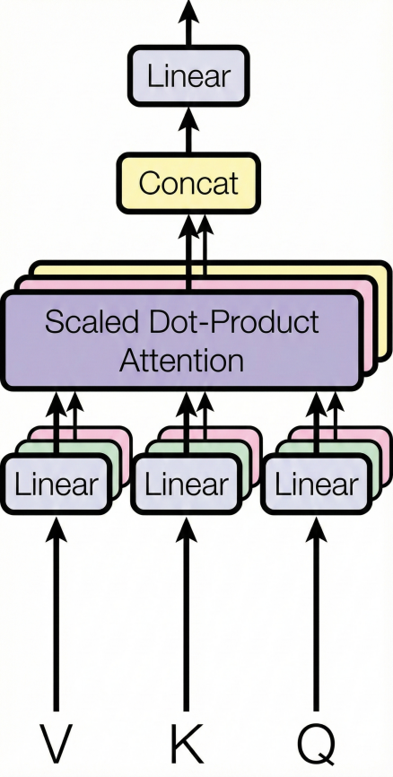<br>图 2-10　风格迁移生成图像</td>
  </tr>
</table>
</div>

不难发现，在未显式指定扁平化风格与配色方案的前提下，生成结果在整体视觉语言上仍然高度继承了参考图的风格特征。

相信你已经注意到了，在上述两个图生图示例中，我们同时运用了前文介绍的文生图技巧。多种技巧的组合使用是完全可行的，但需要注意的是，参考图像与文字指令之间应保持一致，避免在结构或风格层面出现相互冲突的约束。

## 2.3 辅助工具推荐

2.2节已经集中讨论了 Nano-Banana Pro
的核心功能，但在真实的科研绘图流程中，图像生成模型只承担其中一个关键环节。要让生成结果真正进入论文、汇报或投稿体系，还需要一组围绕其前后衔接的辅助工具。

这些工具并不以功能复杂取胜，它们的价值主要体现在两个方面：一是降低从想法到图像之间的操作摩擦，二是补齐生成模型在流程边界处的能力空缺。本节将按照科研绘图的时间顺序，分别介绍生成前与生成后常用的几类辅助工具，帮你构建一套完整且顺手的工具链。

### 2.3.1 前处理工具

前处理工具的核心任务，在于模型调用之前，尽可能明确图像的结构、布局与视觉边界，从而减少生成阶段的不确定性。

**1. 草图绘制工具**

在2.2节介绍图生图方法时已经提到，结构草图作为参考图，在科研绘图中承担着确立空间拓扑与逻辑关系的约束作用。**用于绘制草图的工具并不存在统一的最优解，真正重要的是能否够快速、明确地表达结构意图**。

对于大多数科研人员，草图绘制工具并不需要很复杂。无论是操作系统自带的画图软件，PowerPoint 中最基础的形状与箭头工具，还是 Excalidraw、draw.io 这类轻量级流程或示意图工具，都足以承担这一阶段的任务。在很多情况下，甚至只需要一张 A4 纸和一支笔，就能完成对结构关系的初步表达。

我们使用这些工具的目标并非画出精致图像，而是尽快明确图像的空间布局与逻辑关系。只要结构清晰，线条是否规整并不重要。在图生图阶段，模型会将这些草图视为视觉骨架，并在此基础上完成风格与细节层面的优化。

**2. 配色提取工具**

配色提取工具主要用于解决另一个常见问题：如何**快速获得已经在高水平科研插图中被验证过的配色方案**。

在阅读高水平期刊论文时，我们常常会遇到配色与风格都非常成熟的插图。通过配色提取工具，则可以直接从这些插图中获取对应的 HEX 色值，用于后续的提示词编写或统一整篇论文的视觉风格。

这类工具并非必需，但如果你想复用顶级期刊中常见的低饱和度配色方案，或者需要在多张插图之间保持严格的颜色一致性，这类工具会显著提升你的效率。许多设计软件本身已经内置取色功能。如果你不希望额外安装工具，直接在浏览器中搜索并选取在线的取色工具，同样可以完成这一任务。

### 2.3.2 后处理工具

生成模型输出的图像，通常还无法直接用于正式的科研场景。这类结果往往会存在水印、分辨率不足，或在局部结构与细节上需要进一步修正。因此，后处理工具的作用，在于将 AI 生成的图像逐步整理为可继续编辑、可反复使用的论文插图素材或参考图像，而非简单地对生成结果进行修补。

**１.去水印工具**

部分生成平台会在输出图像中附带水印。在合规使用的前提下，可以借助专门的去水印工具对图像进行处理。

例如，开源项目 [gemini-watermark-remover](https://github.com/GargantuaX/gemini-watermark-remover/tree/main) 通过反向 Alpha 混合算法对透明度进行还原，能够在不引入额外视觉噪声的前提下恢复图像的原始结构。 这一步的目标，是**尽可能获得一张干净、稳定的基础素材，为后续处理打好基础**。

需要注意的是，由 Nano-Banana Pro 生成的图像不仅包含直观可见的 Google 视觉水印，[谷歌官方文档](https://ai.google.dev/gemini-api/docs/image-generation?hl=zh-cn)还指出其中嵌入了隐形的 SynthID 标记。SynthID 是一种在图像生成阶段将识别信息编码进像素数据深层的数字指纹技术。根据 Google 官方研究，SynthID 在设计时便充分考虑了鲁棒性，能够有效抵御裁剪、缩放、色彩调整与格式转换等常见编辑操作。

[官方论文](https://arxiv.org/html/2510.09263v1#S1)指出，尽管通过大幅压缩、重采样或风格迁移等极端对抗手段，可以在一定程度上降低水印的可检测性，但这类操作往往伴随着明显的图像质量退化。这也是本书不建议将 Nano-Banana Pro 生成的图像直接作为论文终稿插图的重要原因之一。

**２.高清放大工具**

在完成去水印之后，常见的下一步是使用高清放大工具。典型的解决方案是部署 [Real-ESRGAN](https://github.com/xinntao/Real-ESRGAN) 系列模型（支持本地便携版运行）。这一处理的意义在于**为后续的矢量化与可编辑化提供更高质量的输入**。更清晰的边界与细节，有助于提升线条识别、形状分割与文字保留的效果，从而在后续编辑过程中降低整体修改成本。

**３.矢量化与可编辑化工具**

在论文排版或后续修改阶段，插图通常需要进行细节层面的再调整，例如文字标注的位置微调、线条粗细的统一、局部逻辑关系的修正，以及与整篇文稿中其他图形元素的整体协调。表 2-4　整理了 AI 生成图像后的编辑与矢量化方案。

**表 2-4** AI 生成图像后的编辑与矢量化方案

| **方案类型** | **典型工具/代表** | **主要功能与应用场景** |
| :--- | :--- | :--- |
| 在线矢量化工具 | Vectorizer 等 | **快速格式转换：**能将位图转化为 SVG 等通用矢量格式，便于后续在各类软件中进行基础编辑 |
| 专业设计软件 | Adobe Illustrator | **精细化描摹：**利用其内置的"图像描摹"功能，提供对矢量化过程参数（如阈值、路径拟合度）的精细控制能力 |
| 结构化研究项目 | Edit-Banana | **图表语义还原：**尝试将静态图表转化为结构化、可编辑的DrawIO 文件形式 |
| 通用绘图/重绘 | Figma, Visio | **人工参考复刻：**将生成图作为底图参考，手动重绘结构与布局，适合对逻辑严密性要求极高的场景 |
| 代码辅助绘制 | Matplotlib | **完全可控化：**针对规则性较强的图形结构，参考生成结果编写绘图代码，从而获得参数完全可控的矢量素材 |

值得注意的是，上述方案并非互斥的选项。 在实际的科研绘图工作流中，你可以根据需求灵活组合多种工具，以兼顾效率与精度。例如，可以先使用在线工具（如 Vectorizer）快速完成位图到矢量图的基础转换，再将结果导入专业软件（如 Illustrator）进行精细的节点调整，最后结合代码生成的图形结构进行整体组装。

无论选择单一工具还是混合工作流，其核心目标都是一致的： **让 AI 生成的结果真正融入科研写作流程，而不是停留在“好看的图片”层面**。无论是通过在线工具的快速转换，还是借助专业软件与代码的深度重构，最终都是为了实现图像的可编辑化与规范化。

在完整的科研绘图工作流中，Nano-Banana Pro 提供的是核心生成能力，而这些辅助工具则负责在前后两个方向上“托底”。它们并不决定最终效果的上限，却在很大程度上影响整个流程是否顺畅、可控。理解每一类工具在流程中的位置，远比掌握某一个具体软件更为重要。在第 05 章中，我们将结合这些工具，详细演示如何将 AI 生成的原始素材转化为符合出版标准的最终插图。

> [!TIP]
> **本章核心结论速查**
> - **官方渠道**：API 适合自动化，AI Studio 适合调试，网页端门槛最低
> - **模型选型**：Pro 负责质感与细节，Qwen-image-2.0 是懂中文的本土强力平替
> - **核心技法**：文生图靠"逻辑描述"，图生图靠"结构骨架（草图）"
> - **工具链闭环**：结合去水印、高清放大与矢量化工具，才能将"素材"变为"成品"

## 2.4 小结

本章实现了从理念到工具的跨越，全面解构了以 Nano-Banana Pro 为基准的AI 绘图模型的使用形态与功能边界，并梳理了与其配套的上下游工具链。为了帮助你更直观地复盘本章要点，图 2-11 将本章核心内容整理为了一张全景式的知识脉络图。

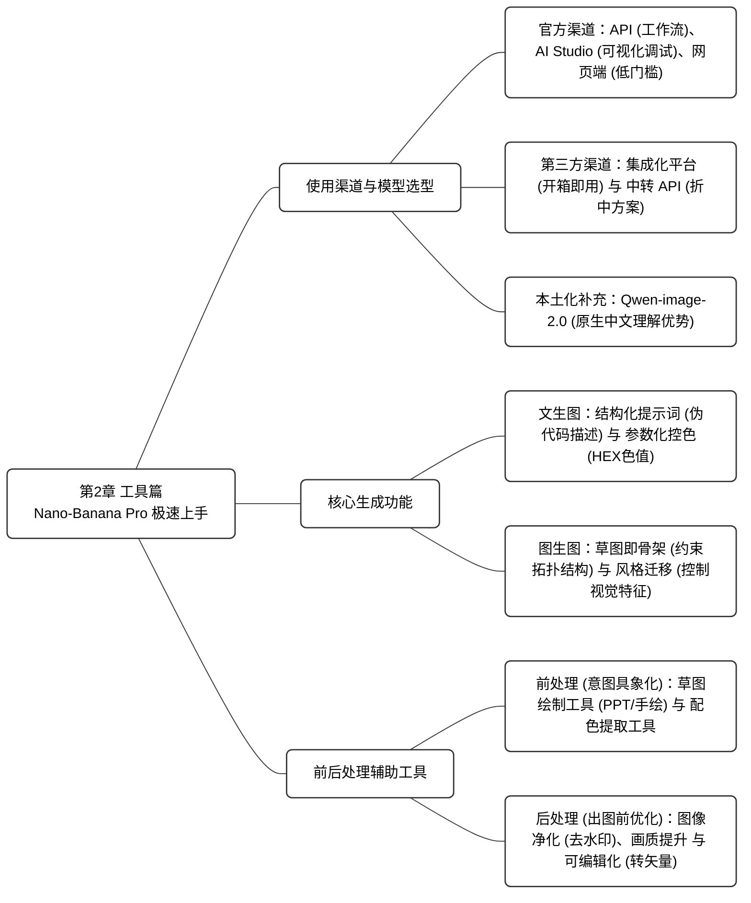

<div align="center">
  图 2-11　第 02 章知识脉络图
</div>

工具本身并不是目的，而是实现科研表达的手段。第 03 章将正式进入实战环节，揭示如何利用 AI 实现从论文内容到可控结构示意图的完整转化方法论。